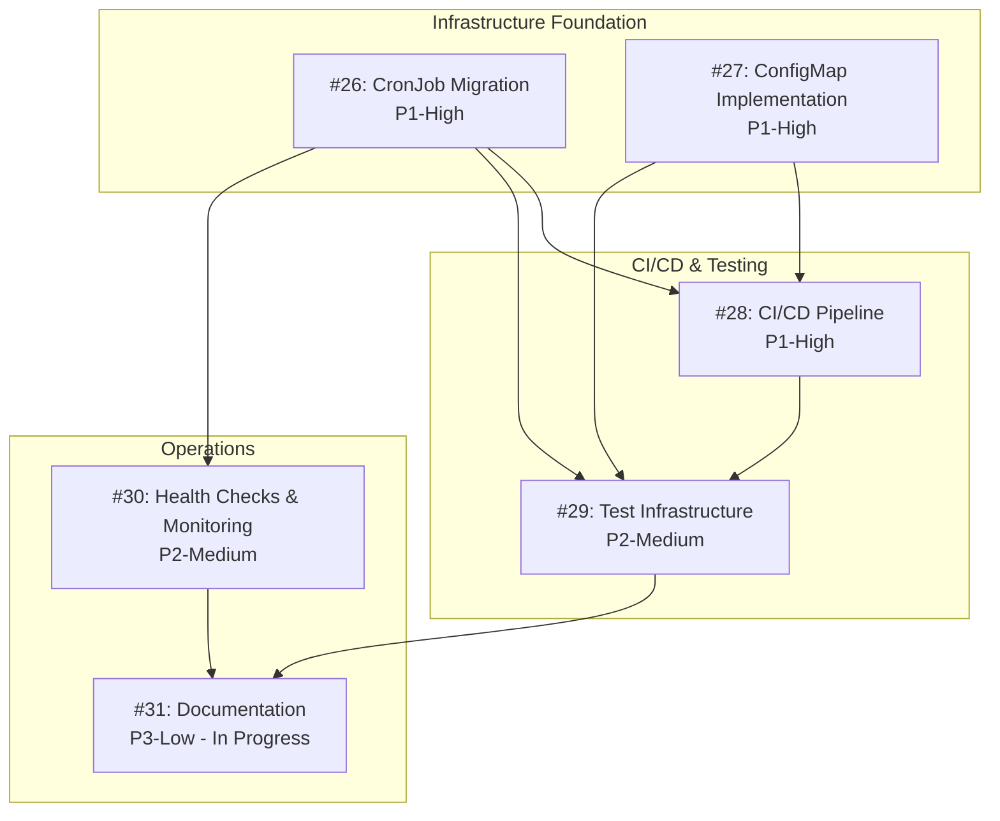

# Dependency Analysis and Work Order Recommendation

## Issue Overview

### Priority Summary
- **High Priority (P1)**: #26, #27, #28
- **Medium Priority (P2)**: #29, #30  
- **Low Priority (P3)**: #31

### Issue Status
- **In Progress**: #31 (status:tested, tests:approved, plan:approved)
- **New**: #26, #27, #28, #29, #30

## Dependency Graph



## Detailed Dependencies

### #26: Kubernetes CronJob Migration
- **Blocks**: 
  - #28 (CI/CD needs to handle CronJob manifests)
  - #29 (Tests need to validate CronJob configurations)
  - #30 (Health checks need adaptation for CronJob pattern)
- **Blocked by**: None
- **Can work in parallel with**: #27

### #27: ConfigMap Implementation
- **Blocks**:
  - #28 (CI/CD needs to manage ConfigMaps)
  - #29 (Tests need to validate ConfigMap mounting)
- **Blocked by**: None
- **Can work in parallel with**: #26

### #28: CI/CD Pipeline Enhancement
- **Blocks**:
  - #29 (Test infrastructure needs CI/CD integration)
- **Blocked by**:
  - #26 (needs CronJob manifests to build)
  - #27 (needs ConfigMap templates to deploy)
- **Can work in parallel with**: None (after #26 & #27)

### #29: Test Infrastructure
- **Blocks**:
  - #31 (Documentation needs test execution details)
- **Blocked by**:
  - #26 (needs CronJob patterns to test)
  - #27 (needs ConfigMap mounting to test)
  - #28 (needs CI/CD for automated testing)
- **Can work in parallel with**: #30 (after prerequisites)

### #30: Health Checks & Monitoring
- **Blocks**:
  - #31 (Documentation needs monitoring procedures)
- **Blocked by**:
  - #26 (CronJob pattern affects probe configuration)
- **Can work in parallel with**: #29 (after #26)

### #31: Documentation (In Progress)
- **Blocks**: None
- **Blocked by**:
  - #29 (needs test procedures)
  - #30 (needs monitoring guides)
- **Can work in parallel with**: Can continue with existing content

## Recommended Work Order

### Phase 1: Infrastructure Foundation (Parallel Work Possible)
**Timeline**: 3-4 days total (2 days if done in parallel)
1. **#26: CronJob Migration** (2 days) - Assignee A
2. **#27: ConfigMap Implementation** (2 days) - Assignee B

**Rationale**: These are foundational changes that don't depend on each other and unlock all subsequent work. They can be developed in parallel using separate worktrees.

### Phase 2: CI/CD Pipeline
**Timeline**: 3 days
3. **#28: CI/CD Pipeline Enhancement** (3 days)

**Rationale**: Must wait for #26 and #27 to complete as it needs to build and deploy the new architecture. This is critical for automating deployments.

### Phase 3: Quality & Operations (Parallel Work Possible)
**Timeline**: 4-6 days total (4 days if done in parallel)
4. **#29: Test Infrastructure** (4 days) - Assignee A
5. **#30: Health Checks & Monitoring** (2 days) - Assignee B

**Rationale**: These can be worked on in parallel after the CI/CD pipeline is ready. They're both medium priority and complement each other.

### Phase 4: Documentation Completion
**Timeline**: 1-2 days (remaining work)
6. **#31: Complete Documentation** (1-2 days to finish)

**Rationale**: Already in progress and can incorporate learnings from all other implementations.

## Optimal Resource Allocation

### For Single Developer
- **Total Timeline**: 12-15 days
- **Order**: #26 → #27 → #28 → #29 → #30 → #31

### For Two Developers
- **Total Timeline**: 9-11 days
- **Developer A**: #26 → #28 → #29
- **Developer B**: #27 → #30 → #31 (completion)

### For Three Developers
- **Total Timeline**: 7-8 days
- **Developer A**: #26 → #29
- **Developer B**: #27 → #30
- **Developer C**: Wait for #26/#27 → #28 → #31

## Risk Mitigation

### Critical Path
The critical path is: (#26 or #27) → #28 → #29 → #31

### Key Risks
1. **CronJob Migration Complexity**: May discover edge cases in scheduling logic
   - Mitigation: Thorough testing of all time windows before removing Deployments
   
2. **ConfigMap Size Limits**: Team data might exceed ConfigMap size limits (1MB)
   - Mitigation: Prepare alternative using multiple ConfigMaps if needed

3. **CI/CD Integration Issues**: Docker Hub credentials or multi-platform builds might fail
   - Mitigation: Test with personal Docker Hub account first

4. **Test Infrastructure Scope**: Comprehensive testing might take longer than estimated
   - Mitigation: Focus on critical path tests first, add nice-to-have tests later

## Parallelization Strategy

### Worktree Setup for Parallel Development
```bash
# Developer A: CronJob Migration
git worktree add -b feature/issue-26-cronjob ../league-simulator-26

# Developer B: ConfigMap Implementation
git worktree add -b feature/issue-27-configmap ../league-simulator-27

# Work can proceed independently with regular sync meetings
```

### Merge Strategy
1. Merge #27 (ConfigMap) first - simpler change
2. Merge #26 (CronJob) second - rebase on #27 if needed
3. Create integration branch for #28 that pulls both changes

## Success Metrics

- **Phase 1 Success**: Both CronJob and ConfigMap implementations tested locally
- **Phase 2 Success**: Automated builds pushing to Docker Hub
- **Phase 3 Success**: All tests passing, monitoring dashboard live
- **Phase 4 Success**: Complete documentation enabling new team member onboarding

## Recommendations

1. **Start immediately with Phase 1** using parallel development
2. **Assign dedicated developers** to avoid context switching
3. **Daily sync meetings** during parallel work phases
4. **Feature flags** for gradual rollout of CronJob migration
5. **Keep old Deployments** running during transition period