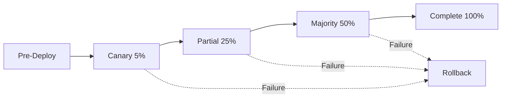

# Deployment Safety Test Infrastructure

## Overview

This document describes the comprehensive test infrastructure for ensuring safe and reliable deployments of the League Simulator application. The infrastructure covers all critical aspects of deployment safety including pre-deployment validation, performance testing, security compliance, chaos engineering, and automated rollback procedures.

## Architecture

```
tests/
├── deployment/
│   ├── test_infrastructure.R      # Core utilities and helpers
│   ├── pre-deployment/           # Pre-flight checks
│   ├── deployment/               # Deployment process tests
│   ├── post-deployment/          # Post-deployment verification
│   └── rollback/                 # Rollback safety tests
├── resilience/                   # Chaos engineering tests
├── security/                     # Security and compliance tests
└── run-deployment-tests.R        # CI/CD test runner
```

## Test Categories

### 1. Pre-Deployment Validation

**Purpose**: Ensure the environment and application are ready for deployment.

**Tests**:
- Environment variable validation
- Configuration file integrity
- Docker image security scanning
- Dependency version verification
- Directory permissions check

**Usage**:
```r
Rscript tests/run-deployment-tests.R pre-deployment staging
```

### 2. Performance Testing

**Purpose**: Validate performance against empirical baselines to prevent regression.

**Tests**:
- API response time SLA validation
- Resource utilization monitoring
- Concurrent request handling
- Performance trend analysis
- Memory leak detection

**Key Metrics**:
- Median response time: < 100ms
- 95th percentile: < 500ms
- Memory usage: < 1GB per pod
- CPU usage: < 80% sustained

### 3. Integration Testing

**Purpose**: Ensure all components work together correctly after deployment.

**Tests**:
- End-to-end smoke tests
- API endpoint validation
- Shiny UI functionality
- Data persistence verification
- Multi-service communication

### 4. Security & Compliance

**Purpose**: Validate security posture and regulatory compliance.

**Tests**:
- Secret exposure detection
- Security header validation
- Authentication/authorization
- Input validation & injection prevention
- GDPR compliance checks
- Audit logging verification

**Security Checklist**:
- [ ] No secrets in logs or responses
- [ ] All security headers present
- [ ] Rate limiting active
- [ ] HTTPS enforced
- [ ] CORS properly configured

### 5. Chaos Engineering

**Purpose**: Test system resilience under failure conditions.

**Tests**:
- Pod failure recovery
- Network partition handling
- Resource exhaustion scenarios
- Database connection failures
- Cascading failure prevention

**Failure Scenarios**:
```yaml
scenarios:
  pod_failure:
    action: delete_random_pod
    expected_recovery: < 60s
  network_latency:
    delay: 200ms
    error_threshold: 5%
  resource_exhaustion:
    type: memory_pressure
    behavior: graceful_degradation
```

### 6. Rollback Safety

**Purpose**: Ensure safe and quick rollback capabilities.

**Tests**:
- Automated rollback triggers
- Manual rollback procedures
- Data integrity during rollback
- Version history maintenance
- Emergency rollback validation

**Rollback Triggers**:
- Health check failures (3 consecutive)
- Error rate > 5%
- Response time > 2x baseline
- Manual intervention

## CI/CD Integration

### GitHub Actions Workflows

1. **deployment-safety-tests.yml**: Main test orchestration
2. **deployment-stages.yml**: Progressive rollout with gates

### Deployment Stages



### Safety Gates

Each stage includes:
- Automated tests
- Metric validation
- Manual approval (production)
- Rollback readiness

## Monitoring Integration

### Health Endpoints

```r
/health   - Basic health check
/ready    - Readiness probe
/alive    - Liveness probe
/metrics  - Prometheus metrics
```

### Key Metrics

```yaml
deployment_safety_metrics:
  - deployment_duration_seconds
  - rollback_frequency
  - test_pass_rate
  - security_scan_findings
  - performance_regression_detected
```

## Usage Guide

### Running Tests Locally

```bash
# All tests
Rscript tests/run-deployment-tests.R all local

# Specific suite
Rscript tests/run-deployment-tests.R security staging

# With environment
TEST_DEPLOYED_APP=TRUE Rscript tests/run-deployment-tests.R integration production
```

### CI/CD Execution

```yaml
# In GitHub Actions
- name: Run deployment safety tests
  env:
    TEST_ENVIRONMENT: staging
  run: |
    Rscript tests/run-deployment-tests.R all staging
```

### Manual Deployment Checklist

Before deploying to production:

1. **Pre-Deployment**
   - [ ] All tests passing in CI
   - [ ] Security scan clean
   - [ ] Performance baselines met
   - [ ] Staging deployment successful

2. **During Deployment**
   - [ ] Monitor canary metrics
   - [ ] Check error rates
   - [ ] Verify performance
   - [ ] Watch for alerts

3. **Post-Deployment**
   - [ ] Run smoke tests
   - [ ] Verify data integrity
   - [ ] Check monitoring dashboards
   - [ ] Update deployment log

## Troubleshooting

### Common Issues

1. **Health check failures**
   - Check `/health` endpoint manually
   - Verify environment variables
   - Check application logs

2. **Performance regression**
   - Compare with baseline metrics
   - Check resource allocation
   - Review recent changes

3. **Security violations**
   - Run security scan locally
   - Check for exposed secrets
   - Verify security headers

### Emergency Procedures

```bash
# Immediate rollback
kubectl rollout undo deployment/league-simulator

# Check rollback status
kubectl rollout status deployment/league-simulator

# Verify health
curl https://league-simulator.prod/health
```

## Maintenance

### Updating Baselines

```r
# Update performance baselines
Rscript tests/performance/measure-baselines.R

# Update security policies
Rscript tests/security/update-policies.R
```

### Adding New Tests

1. Create test file in appropriate directory
2. Follow existing test patterns
3. Update test suite configuration
4. Add to CI/CD workflow

## Best Practices

1. **Always test in staging first**
2. **Monitor for 30 minutes post-deployment**
3. **Keep rollback procedures updated**
4. **Review test failures before override**
5. **Document any manual interventions**

## References

- [Kubernetes Deployment Best Practices](https://kubernetes.io/docs/concepts/workloads/controllers/deployment/)
- [OWASP Security Testing Guide](https://owasp.org/www-project-web-security-testing-guide/)
- [Chaos Engineering Principles](https://principlesofchaos.org/)
- [SRE Handbook - Safe Releases](https://sre.google/sre-book/release-engineering/)