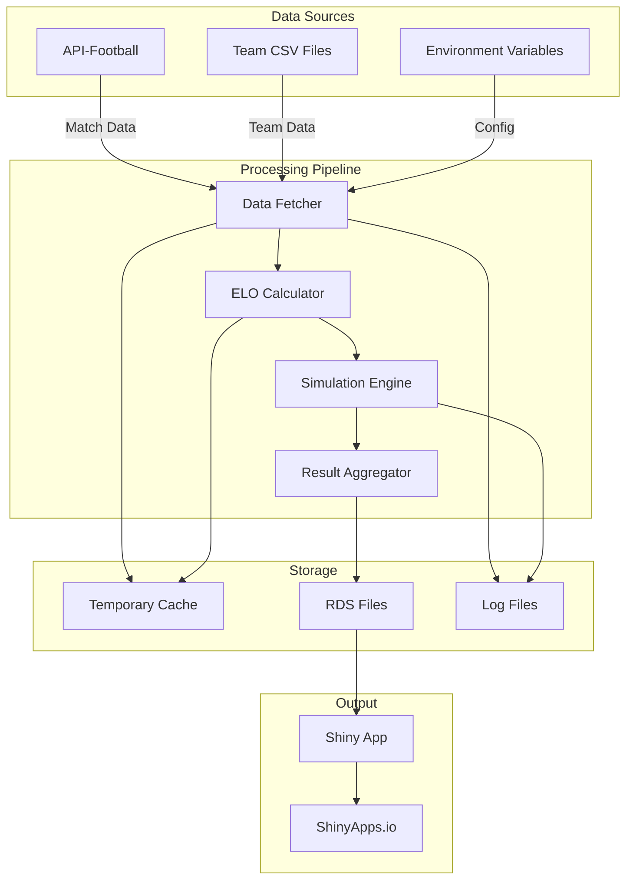

# Data Flow Architecture

Detailed documentation of data flow through the League Simulator system.

## Data Flow Overview



## Data Types and Formats

### 1. Input Data

#### Team Data (CSV)
```csv
# RCode/TeamList_2025.csv
id,name,elo,liga,season
159,Hertha BSC,1616.59375,2,2025
173,1. FC Köln,1703.81005859375,2,2025
168,Bayer Leverkusen,1834.490966796875,1,2025
```

**Schema:**
- `id`: Unique team identifier (integer)
- `name`: Team name (string)
- `elo`: Current ELO rating (float)
- `liga`: League level (1, 2, or 3)
- `season`: Season year (integer)

#### API Match Data
```json
{
  "fixture": {
    "id": 867945,
    "date": "2025-01-18T14:30:00+00:00",
    "status": {
      "short": "FT",
      "elapsed": 90
    }
  },
  "teams": {
    "home": {
      "id": 168,
      "name": "Bayer Leverkusen"
    },
    "away": {
      "id": 165,
      "name": "Borussia Dortmund"
    }
  },
  "goals": {
    "home": 3,
    "away": 2
  }
}
```

### 2. Processing Data

#### ELO Update Structure
```r
# Internal representation during processing
elo_update <- list(
  home_team_id = 168,
  away_team_id = 165,
  home_elo_before = 1834.49,
  away_elo_before = 1789.23,
  home_score = 3,
  away_score = 2,
  home_elo_after = 1844.12,
  away_elo_after = 1779.60,
  k_factor = 32,
  expected_home = 0.567,
  actual_home = 1
)
```

#### Simulation State
```r
# During simulation
simulation_state <- list(
  league_id = 78,
  season = 2025,
  iteration = 1,
  current_matchday = 18,
  team_points = c(45, 42, 39, ...),
  team_goals_for = c(48, 45, 37, ...),
  team_goals_against = c(18, 22, 25, ...),
  remaining_matches = list(...)
)
```

### 3. Output Data

#### Simulation Results (RDS)
```r
# Structure of Ergebnis.Rds
results <- list(
  metadata = list(
    league_id = 78,
    league_name = "Bundesliga",
    season = 2025,
    simulation_date = "2025-01-19 15:00:00",
    iterations = 10000
  ),
  probability_matrix = matrix(
    # 18 teams x 18 positions
    # Each cell = probability of team finishing in position
    data = c(0.892, 0.098, 0.010, ...),
    nrow = 18,
    ncol = 18
  ),
  team_names = c("Bayern Munich", "Bayer Leverkusen", ...),
  current_standings = data.frame(
    position = 1:18,
    team = c(...),
    points = c(...),
    played = c(...),
    goal_diff = c(...)
  )
)
```

## Data Processing Pipeline

### Stage 1: Data Collection

```r
# RCode/retrieveResults.R
retrieve_match_data <- function(league_id, season) {
  # 1. Set up API connection
  api_key <- Sys.getenv("RAPIDAPI_KEY")
  base_url <- "https://v3.football.api-sports.io"
  
  # 2. Fetch fixtures
  fixtures_endpoint <- sprintf("%s/fixtures?league=%d&season=%d", 
                               base_url, league_id, season)
  
  response <- GET(
    url = fixtures_endpoint,
    add_headers(
      "X-RapidAPI-Key" = api_key,
      "X-RapidAPI-Host" = "v3.football.api-sports.io"
    )
  )
  
  # 3. Parse response
  fixtures <- content(response)$response
  
  # 4. Filter completed matches
  completed_matches <- Filter(function(f) {
    f$fixture$status$short == "FT"
  }, fixtures)
  
  return(completed_matches)
}
```

### Stage 2: ELO Calculation

```cpp
// RCode/SpielNichtSimulieren.cpp
#include <Rcpp.h>
using namespace Rcpp;

// [[Rcpp::export]]
List updateEloRatings(DataFrame teams, List match_result) {
  // Extract match data
  int home_id = match_result["home_team_id"];
  int away_id = match_result["away_team_id"];
  int home_goals = match_result["home_goals"];
  int away_goals = match_result["away_goals"];
  
  // Get current ELO ratings
  NumericVector elo_ratings = teams["elo"];
  IntegerVector team_ids = teams["id"];
  
  // Find team indices
  int home_idx = std::find(team_ids.begin(), team_ids.end(), home_id) - team_ids.begin();
  int away_idx = std::find(team_ids.begin(), team_ids.end(), away_id) - team_ids.begin();
  
  double home_elo = elo_ratings[home_idx];
  double away_elo = elo_ratings[away_idx];
  
  // Calculate expected scores
  double expected_home = 1.0 / (1.0 + pow(10.0, (away_elo - home_elo) / 400.0));
  double expected_away = 1.0 - expected_home;
  
  // Actual scores
  double actual_home = (home_goals > away_goals) ? 1.0 : 
                       (home_goals < away_goals) ? 0.0 : 0.5;
  double actual_away = 1.0 - actual_home;
  
  // Update ELO ratings
  double k_factor = 32.0;
  elo_ratings[home_idx] += k_factor * (actual_home - expected_home);
  elo_ratings[away_idx] += k_factor * (actual_away - expected_away);
  
  // Return updated teams
  teams["elo"] = elo_ratings;
  return List::create(
    Named("teams") = teams,
    Named("home_elo_change") = elo_ratings[home_idx] - home_elo,
    Named("away_elo_change") = elo_ratings[away_idx] - away_elo
  );
}
```

### Stage 3: Monte Carlo Simulation

```r
# RCode/simulationsCPP.R
run_monte_carlo_simulation <- function(teams, remaining_fixtures, iterations = 10000) {
  # Initialize result matrix
  n_teams <- nrow(teams)
  position_matrix <- matrix(0, nrow = n_teams, ncol = n_teams)
  
  # Run iterations
  for (iter in 1:iterations) {
    # Copy current standings
    sim_teams <- teams
    
    # Simulate remaining matches
    for (fixture in remaining_fixtures) {
      result <- simulate_match(
        home_elo = sim_teams$elo[sim_teams$id == fixture$home_id],
        away_elo = sim_teams$elo[sim_teams$id == fixture$away_id]
      )
      
      # Update points
      sim_teams <- update_standings(sim_teams, fixture, result)
    }
    
    # Record final positions
    final_positions <- order(sim_teams$points, 
                            sim_teams$goal_diff, 
                            sim_teams$goals_for,
                            decreasing = TRUE)
    
    for (i in 1:n_teams) {
      position_matrix[i, final_positions[i]] <- 
        position_matrix[i, final_positions[i]] + 1
    }
  }
  
  # Convert to probabilities
  position_matrix <- position_matrix / iterations
  
  return(position_matrix)
}
```

### Stage 4: Result Aggregation

```r
# RCode/transform_data.R
aggregate_simulation_results <- function(position_matrix, teams, metadata) {
  # Create comprehensive results object
  results <- list()
  
  # Add metadata
  results$metadata <- metadata
  results$metadata$timestamp <- Sys.time()
  
  # Add probability matrix
  results$probability_matrix <- position_matrix
  rownames(results$probability_matrix) <- teams$name
  colnames(results$probability_matrix) <- paste("Position", 1:nrow(teams))
  
  # Calculate summary statistics
  results$summary <- data.frame(
    team = teams$name,
    current_position = rank(-teams$points, ties.method = "min"),
    expected_position = apply(position_matrix, 1, function(row) {
      sum(row * 1:length(row))
    }),
    championship_prob = position_matrix[, 1],
    top4_prob = rowSums(position_matrix[, 1:4]),
    relegation_prob = rowSums(position_matrix[, (nrow(teams)-2):nrow(teams)])
  )
  
  # Add current standings
  results$current_standings <- teams[order(teams$points, decreasing = TRUE), ]
  
  return(results)
}
```

## Data Storage Patterns

### File System Layout

```
/app/
├── RCode/
│   ├── TeamList_2023.csv    # Historical data
│   ├── TeamList_2024.csv    # Previous season
│   └── TeamList_2025.csv    # Current season
├── ShinyApp/
│   └── data/
│       ├── Ergebnis.Rds     # Latest simulation
│       ├── Ergebnis_78.Rds  # Bundesliga
│       ├── Ergebnis_79.Rds  # 2. Bundesliga
│       └── Ergebnis_80.Rds  # 3. Liga
└── logs/
    ├── simulation_20250119.log
    └── api_requests_20250119.log
```

### Data Retention Policy

| Data Type | Retention Period | Storage Location |
|-----------|-----------------|------------------|
| Team Lists | Permanent | Version control |
| Simulation Results | 7 days | Local filesystem |
| API Responses | 1 hour | Memory cache |
| Logs | 30 days | Log rotation |

## Data Validation

### Input Validation

```r
validate_team_data <- function(teams_df) {
  errors <- list()
  
  # Check required columns
  required_cols <- c("id", "name", "elo", "liga", "season")
  missing_cols <- setdiff(required_cols, names(teams_df))
  if (length(missing_cols) > 0) {
    errors$missing_columns <- missing_cols
  }
  
  # Check data types
  if (!is.numeric(teams_df$id)) {
    errors$invalid_id <- "ID must be numeric"
  }
  
  # Check ELO range
  invalid_elo <- which(teams_df$elo < 0 | teams_df$elo > 3000)
  if (length(invalid_elo) > 0) {
    errors$invalid_elo <- paste("Invalid ELO for teams:", 
                                paste(teams_df$name[invalid_elo], collapse = ", "))
  }
  
  # Check liga values
  if (!all(teams_df$liga %in% c(1, 2, 3))) {
    errors$invalid_liga <- "Liga must be 1, 2, or 3"
  }
  
  if (length(errors) > 0) {
    stop(paste("Validation errors:", errors))
  }
  
  return(TRUE)
}
```

### Output Validation

```r
validate_simulation_results <- function(results) {
  # Check probability matrix
  prob_matrix <- results$probability_matrix
  
  # Each row should sum to 1
  row_sums <- rowSums(prob_matrix)
  if (!all(abs(row_sums - 1) < 0.001)) {
    warning("Probability matrix rows don't sum to 1")
  }
  
  # All values should be between 0 and 1
  if (any(prob_matrix < 0 | prob_matrix > 1)) {
    stop("Invalid probabilities in matrix")
  }
  
  # Check metadata
  required_meta <- c("league_id", "season", "iterations", "timestamp")
  if (!all(required_meta %in% names(results$metadata))) {
    stop("Missing required metadata")
  }
  
  return(TRUE)
}
```

## Performance Considerations

### Data Loading Optimization

```r
# Lazy loading for large datasets
load_simulation_results <- function(league_id) {
  file_path <- sprintf("ShinyApp/data/Ergebnis_%d.Rds", league_id)
  
  # Check file size
  file_size <- file.info(file_path)$size
  
  if (file_size > 100 * 1024 * 1024) {  # > 100MB
    # Use memory mapping for large files
    return(readRDS(file_path, refhook = function(x) x))
  } else {
    # Standard loading for smaller files
    return(readRDS(file_path))
  }
}
```

### Streaming Data Processing

```r
# Process matches in chunks to reduce memory usage
process_matches_streaming <- function(matches, chunk_size = 100) {
  n_matches <- length(matches)
  n_chunks <- ceiling(n_matches / chunk_size)
  
  for (i in 1:n_chunks) {
    start_idx <- (i - 1) * chunk_size + 1
    end_idx <- min(i * chunk_size, n_matches)
    
    chunk <- matches[start_idx:end_idx]
    process_match_chunk(chunk)
    
    # Allow garbage collection
    gc()
  }
}
```

## Data Flow Monitoring

### Metrics Collection

```r
# Track data flow metrics
data_flow_metrics <- list(
  api_requests = 0,
  api_errors = 0,
  matches_processed = 0,
  simulations_completed = 0,
  files_written = 0,
  total_processing_time = 0
)

track_metric <- function(metric, value = 1) {
  data_flow_metrics[[metric]] <<- data_flow_metrics[[metric]] + value
  
  # Log to monitoring system
  cat(sprintf("[METRIC] %s: %d\n", metric, data_flow_metrics[[metric]]))
}
```

### Data Lineage

```r
# Track data transformations
create_lineage_record <- function(input_files, output_file, transformation) {
  lineage <- list(
    timestamp = Sys.time(),
    input_files = input_files,
    output_file = output_file,
    transformation = transformation,
    version = packageVersion("LeagueSimulator"),
    environment = Sys.getenv("ENVIRONMENT", "production")
  )
  
  # Append to lineage log
  saveRDS(lineage, file = sprintf("lineage/%s.rds", 
                                  format(Sys.time(), "%Y%m%d_%H%M%S")))
}
```

## Error Handling in Data Flow

### Graceful Degradation

```r
fetch_data_with_fallback <- function(league_id, season) {
  tryCatch({
    # Try API first
    api_data <- retrieve_match_data(league_id, season)
    return(list(data = api_data, source = "api"))
  }, error = function(e) {
    warning("API failed, trying cache: ", e$message)
    
    # Try cache
    cache_file <- sprintf("cache/matches_%d_%d.rds", league_id, season)
    if (file.exists(cache_file)) {
      cache_data <- readRDS(cache_file)
      return(list(data = cache_data, source = "cache"))
    }
    
    # Final fallback - use last known good data
    stop("No data available for simulation")
  })
}
```

### Data Recovery

```r
recover_partial_simulation <- function(checkpoint_file) {
  if (!file.exists(checkpoint_file)) {
    return(NULL)
  }
  
  checkpoint <- readRDS(checkpoint_file)
  
  cat(sprintf("Recovering from iteration %d/%d\n", 
              checkpoint$current_iteration, 
              checkpoint$total_iterations))
  
  # Resume simulation from checkpoint
  continue_simulation(
    state = checkpoint$state,
    start_iteration = checkpoint$current_iteration + 1,
    total_iterations = checkpoint$total_iterations
  )
}
```

## Related Documentation

- [Architecture Overview](overview.md)
- [API Reference](api-reference.md)
- [Performance Tuning](../troubleshooting/performance.md)
- [Data Management](../operations/backup-recovery.md)