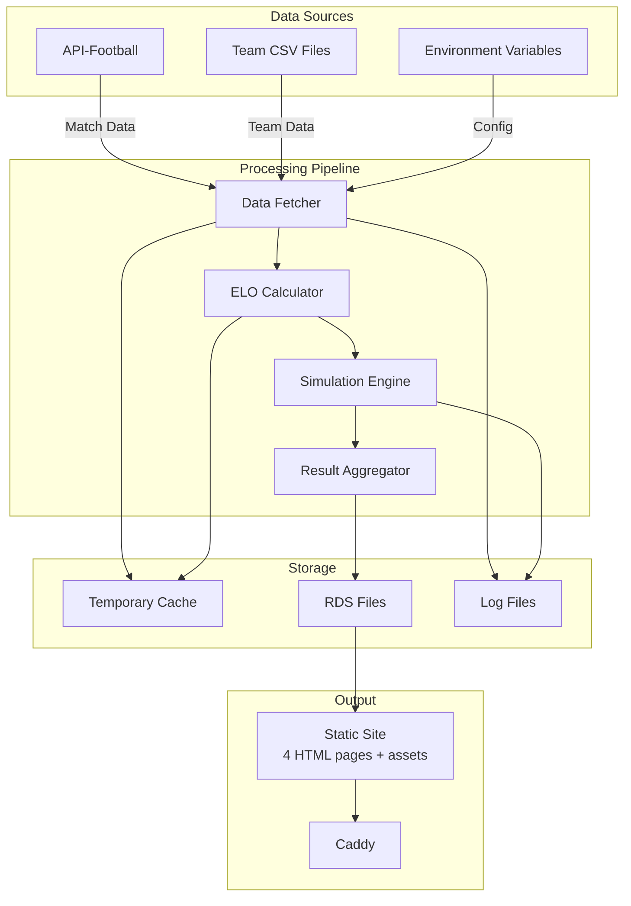

# Data Flow Architecture

Detailed documentation of data flow through the League Simulator system.

## Data Flow Overview


```mermaid
graph TD
    subgraph "Data Sources"
        API[API-Football]
        CSV[Team CSV Files]
        ENV[Environment Variables]
    end
    
    subgraph "Processing Pipeline"
        FETCH[Data Fetcher]
        ELO[ELO Calculator]
        SIM[Simulation Engine]
        AGG[Result Aggregator]
    end
    
    subgraph "Storage"
        TEMP[Temporary Cache]
        RDS[RDS Files]
        LOGS[Log Files]
    end
    
    subgraph "Output"
        SITE[Static Site<br/>4 HTML pages + assets]
        CADDY[Caddy]
    end
    
    API -->|Match Data| FETCH
    CSV -->|Team Data| FETCH
    ENV -->|Config| FETCH
    
    FETCH --> ELO
    ELO --> SIM
    SIM --> AGG
    
    FETCH --> TEMP
    ELO --> TEMP
    AGG --> RDS
    
    RDS --> SITE
    SITE --> CADDY
    
    FETCH --> LOGS
    SIM --> LOGS
```

## Data Types and Formats

### 1. Input Data

#### Team Data (CSV)
```csv
# RCode/TeamList_2025.csv
id,name,elo,liga,season
159,Hertha BSC,1616.59375,2,2025
173,1. FC Köln,1703.81005859375,2,2025
168,Bayer Leverkusen,1834.490966796875,1,2025
```

**Schema:**
- `id`: Unique team identifier (integer)
- `name`: Team name (string)
- `elo`: Current ELO rating (float)
- `liga`: League level (1, 2, or 3)
- `season`: Season year (integer)

#### API Match Data
```json
{
  "fixture": {
    "id": 867945,
    "date": "2025-01-18T14:30:00+00:00",
    "status": {
      "short": "FT",
      "elapsed": 90
    }
  },
  "teams": {
    "home": {
      "id": 168,
      "name": "Bayer Leverkusen"
    },
    "away": {
      "id": 165,
      "name": "Borussia Dortmund"
    }
  },
  "goals": {
    "home": 3,
    "away": 2
  }
}
```

### 2. Processing Data

#### ELO Update Structure
```r
# Internal representation during processing
elo_update <- list(
  home_team_id = 168,
  away_team_id = 165,
  home_elo_before = 1834.49,
  away_elo_before = 1789.23,
  home_score = 3,
  away_score = 2,
  home_elo_after = 1844.12,
  away_elo_after = 1779.60,
  k_factor = 32,
  expected_home = 0.567,
  actual_home = 1
)
```

#### Simulation State
```r
# During simulation
simulation_state <- list(
  league_id = 78,
  season = 2025,
  iteration = 1,
  current_matchday = 18,
  team_points = c(45, 42, 39, ...),
  team_goals_for = c(48, 45, 37, ...),
  team_goals_against = c(18, 22, 25, ...),
  remaining_matches = list(...)
)
```

### 3. Output Data

#### Simulation Results (RDS)

`ShinyApp/data/Ergebnis.Rds` is a **local-only fixture** — a `save()`-image
used by [`scripts/preview_site.R`](../../scripts/preview_site.R) and by
tests, not a production artifact. The production loop never writes it: it
holds the four matrices in memory and hands them straight to
`generate_static_site()` (see [Stage 4](#stage-4-result-aggregation) below).
Where the fixture does exist, it's a `save()`-image, not a single serialized
object — read it with `load()`, not `readRDS()`. It holds four `table`
objects, each a team-by-final-position probability matrix (rows = teams in
current-standings order, columns = final positions 1..N):

```r
load("ShinyApp/data/Ergebnis.Rds")
# -> Ergebnis            # Bundesliga, 18 x 18
# -> Ergebnis2           # 2. Bundesliga, 18 x 18
# -> Ergebnis3           # 3. Liga relegation view, 20 x 20
# -> Ergebnis3_Aufstieg  # 3. Liga promotion view, 20 x 20
#                        # (may be absent on older files -- callers fall
#                        #  back to Ergebnis3)

# Each cell = probability of that team finishing in that position.
Ergebnis[1:3, 1:3]
#                 [,1]  [,2]  [,3]
# Bayern Munich   0.892 0.098 0.010
# Bayer Leverkusen 0.081 0.312 0.201
# ...
```

Row and column names carry the team names and position numbers; there is no
separate metadata or current-standings structure alongside the matrices.
`RCode/generate_static_site.R::generate_static_site()` takes these four
objects directly and renders the four-page static site (see
[Static Site](../deployment/static-site.md)); it does not go through Shiny.

## Data Processing Pipeline

### Stage 1: Data Collection

```r
# RCode/retrieveResults.R
retrieve_match_data <- function(league_id, season) {
  # 1. Set up API connection
  api_key <- Sys.getenv("RAPIDAPI_KEY")
  base_url <- "https://v3.football.api-sports.io"
  
  # 2. Fetch fixtures
  fixtures_endpoint <- sprintf("%s/fixtures?league=%d&season=%d", 
                               base_url, league_id, season)
  
  response <- GET(
    url = fixtures_endpoint,
    add_headers(
      "X-RapidAPI-Key" = api_key,
      "X-RapidAPI-Host" = "v3.football.api-sports.io"
    )
  )
  
  # 3. Parse response
  fixtures <- content(response)$response
  
  # 4. Filter completed matches
  completed_matches <- Filter(function(f) {
    f$fixture$status$short == "FT"
  }, fixtures)
  
  return(completed_matches)
}
```

### Stage 2: ELO Calculation

ELO updates split between two consumers, deliberately:

- **Production loop** (called many times per active window): all ELO + simulation work happens inside the Rust crate at `league-simulator-rust/src/elo/`. R sends the current ELOs and remaining fixtures over the REST seam at `localhost:8080/simulate`; Rust returns the probability matrix. See [`league-simulator-rust/src/elo/mod.rs`](../../league-simulator-rust/src/elo/mod.rs) for the formula and [`league-simulator-rust/src/api/handlers.rs`](../../league-simulator-rust/src/api/handlers.rs) for the wire contract.
- **Season-transition (run once per season, host R, no Rust server)**: pure-R `calculate_elo_update` in [`RCode/elo_aggregation.R`](../../RCode/elo_aggregation.R). Same formula as Rust, byte-identical results across the cross-engine sweep in `tests/testthat/test-elo-aggregation-engine-selection.R`.

### Stage 3: Monte Carlo Simulation

The Monte Carlo loop is a pure Rust function (`run_monte_carlo_simulation` in [`league-simulator-rust/src/monte_carlo/mod.rs`](../../league-simulator-rust/src/monte_carlo/mod.rs)) parallelised with `rayon`. The R orchestrator calls it via [`RCode/rust_integration.R::leagueSimulatorRust()`](../../RCode/rust_integration.R), which marshals the request to JSON, POSTs it to `/simulate`, and re-shapes the returned matrix into the team-by-position `table` format `generate_static_site()` consumes.

### Stage 4: Result Aggregation

The Rust server returns one team-by-position probability matrix per league
call. [`RCode/update_all_leagues_loop.R`](../../RCode/update_all_leagues_loop.R)
collects the three (Bundesliga, 2. Bundesliga, 3. Liga) plus the separate
3. Liga promotion-view matrix into the four bindings `Ergebnis`, `Ergebnis2`,
`Ergebnis3`, `Ergebnis3_Aufstieg` and passes them **in memory, directly**,
to `generate_static_site()` (`RCode/update_all_leagues_loop.R:162`) — there
is no persistence step in the production path. `ShinyApp/data/Ergebnis.Rds`
is not written by this loop; see
[Simulation Results (RDS)](#3-output-data) above for what that file
actually is. There is no separate metadata/summary object either way; row
names, column names, and the matrices themselves are the whole of it.

### Stage 5: Static Site Rendering

`generate_static_site()` in [`RCode/generate_static_site.R`](../../RCode/generate_static_site.R)
takes the four matrices directly and renders four self-contained HTML pages
(`index.html`, `2-bundesliga.html`, `3-liga.html`, `methodik.html`) plus
`assets/site.css`, `assets/fonts/*.woff2`, and `assets/favicon.svg` into
`STATIC_SITE_DIR`. No PNGs are produced — the probability heatmap is an HTML
table with per-cell background colour. See
[Static Site](../deployment/static-site.md) for the full output layout and
how it's served.

## Data Storage Patterns

### File System Layout

```
/app/
├── RCode/
│   ├── TeamList_2023.csv    # Historical data
│   ├── TeamList_2024.csv    # Previous season
│   └── TeamList_2025.csv    # Current season
├── ShinyApp/
│   ├── data/
│   │   └── Ergebnis.Rds     # local-only fixture (preview_site.R, tests) --
│   │                        # save()-image: Ergebnis, Ergebnis2, Ergebnis3,
│   │                        # Ergebnis3_Aufstieg. NOT written by the
│   │                        # production loop -- see Stage 4 above.
│   └── public/               # STATIC_SITE_DIR: generated site (gitignored)
│       ├── index.html
│       ├── 2-bundesliga.html
│       ├── 3-liga.html
│       ├── methodik.html
│       └── assets/
└── logs/
    ├── simulation_20250119.log
    └── api_requests_20250119.log
```

### Data Retention Policy

| Data Type | Retention Period | Storage Location |
|-----------|-----------------|------------------|
| Team Lists | Permanent | Version control |
| Simulation Results | 7 days | Local filesystem |
| API Responses | 1 hour | Memory cache |
| Logs | 30 days | Log rotation |

## Data Validation

### Input Validation

```r
validate_team_data <- function(teams_df) {
  errors <- list()
  
  # Check required columns
  required_cols <- c("id", "name", "elo", "liga", "season")
  missing_cols <- setdiff(required_cols, names(teams_df))
  if (length(missing_cols) > 0) {
    errors$missing_columns <- missing_cols
  }
  
  # Check data types
  if (!is.numeric(teams_df$id)) {
    errors$invalid_id <- "ID must be numeric"
  }
  
  # Check ELO range
  invalid_elo <- which(teams_df$elo < 0 | teams_df$elo > 3000)
  if (length(invalid_elo) > 0) {
    errors$invalid_elo <- paste("Invalid ELO for teams:", 
                                paste(teams_df$name[invalid_elo], collapse = ", "))
  }
  
  # Check liga values
  if (!all(teams_df$liga %in% c(1, 2, 3))) {
    errors$invalid_liga <- "Liga must be 1, 2, or 3"
  }
  
  if (length(errors) > 0) {
    stop(paste("Validation errors:", errors))
  }
  
  return(TRUE)
}
```

### Output Validation

```r
validate_simulation_results <- function(prob_matrix) {
  # prob_matrix is one of Ergebnis / Ergebnis2 / Ergebnis3 / Ergebnis3_Aufstieg
  # -- a team-by-position probability table, not a wrapper list.

  # Each row should sum to 1
  row_sums <- rowSums(prob_matrix)
  if (!all(abs(row_sums - 1) < 0.001)) {
    warning("Probability matrix rows don't sum to 1")
  }

  # All values should be between 0 and 1
  if (any(prob_matrix < 0 | prob_matrix > 1)) {
    stop("Invalid probabilities in matrix")
  }

  return(TRUE)
}
```

## Performance Considerations

### Data Loading Optimization

```r
# ShinyApp/data/Ergebnis.Rds is a save()-image holding all four league
# matrices together, so loading it is a single load() into a fresh
# environment rather than a per-league readRDS().
load_simulation_results <- function(file_path = "ShinyApp/data/Ergebnis.Rds") {
  env <- new.env()
  load(file_path, envir = env)
  env  # exposes Ergebnis, Ergebnis2, Ergebnis3, Ergebnis3_Aufstieg
}
```

### Streaming Data Processing

```r
# Process matches in chunks to reduce memory usage
process_matches_streaming <- function(matches, chunk_size = 100) {
  n_matches <- length(matches)
  n_chunks <- ceiling(n_matches / chunk_size)
  
  for (i in 1:n_chunks) {
    start_idx <- (i - 1) * chunk_size + 1
    end_idx <- min(i * chunk_size, n_matches)
    
    chunk <- matches[start_idx:end_idx]
    process_match_chunk(chunk)
    
    # Allow garbage collection
    gc()
  }
}
```

## Data Flow Monitoring

### Metrics Collection

```r
# Track data flow metrics
data_flow_metrics <- list(
  api_requests = 0,
  api_errors = 0,
  matches_processed = 0,
  simulations_completed = 0,
  files_written = 0,
  total_processing_time = 0
)

track_metric <- function(metric, value = 1) {
  data_flow_metrics[[metric]] <<- data_flow_metrics[[metric]] + value
  
  # Log to monitoring system
  cat(sprintf("[METRIC] %s: %d\n", metric, data_flow_metrics[[metric]]))
}
```

### Data Lineage

```r
# Track data transformations
create_lineage_record <- function(input_files, output_file, transformation) {
  lineage <- list(
    timestamp = Sys.time(),
    input_files = input_files,
    output_file = output_file,
    transformation = transformation,
    version = packageVersion("LeagueSimulator"),
    environment = Sys.getenv("ENVIRONMENT", "production")
  )
  
  # Append to lineage log
  saveRDS(lineage, file = sprintf("lineage/%s.rds", 
                                  format(Sys.time(), "%Y%m%d_%H%M%S")))
}
```

## Error Handling in Data Flow

### Graceful Degradation

```r
fetch_data_with_fallback <- function(league_id, season) {
  tryCatch({
    # Try API first
    api_data <- retrieve_match_data(league_id, season)
    return(list(data = api_data, source = "api"))
  }, error = function(e) {
    warning("API failed, trying cache: ", e$message)
    
    # Try cache
    cache_file <- sprintf("cache/matches_%d_%d.rds", league_id, season)
    if (file.exists(cache_file)) {
      cache_data <- readRDS(cache_file)
      return(list(data = cache_data, source = "cache"))
    }
    
    # Final fallback - use last known good data
    stop("No data available for simulation")
  })
}
```

### Data Recovery

```r
recover_partial_simulation <- function(checkpoint_file) {
  if (!file.exists(checkpoint_file)) {
    return(NULL)
  }
  
  checkpoint <- readRDS(checkpoint_file)
  
  cat(sprintf("Recovering from iteration %d/%d\n", 
              checkpoint$current_iteration, 
              checkpoint$total_iterations))
  
  # Resume simulation from checkpoint
  continue_simulation(
    state = checkpoint$state,
    start_iteration = checkpoint$current_iteration + 1,
    total_iterations = checkpoint$total_iterations
  )
}
```

## Related Documentation

- [Architecture Overview](overview.md)
- [API Reference](api-reference.md)
- [Performance Tuning](../troubleshooting/performance.md)
- [Data Management](../operations/backup-recovery.md)