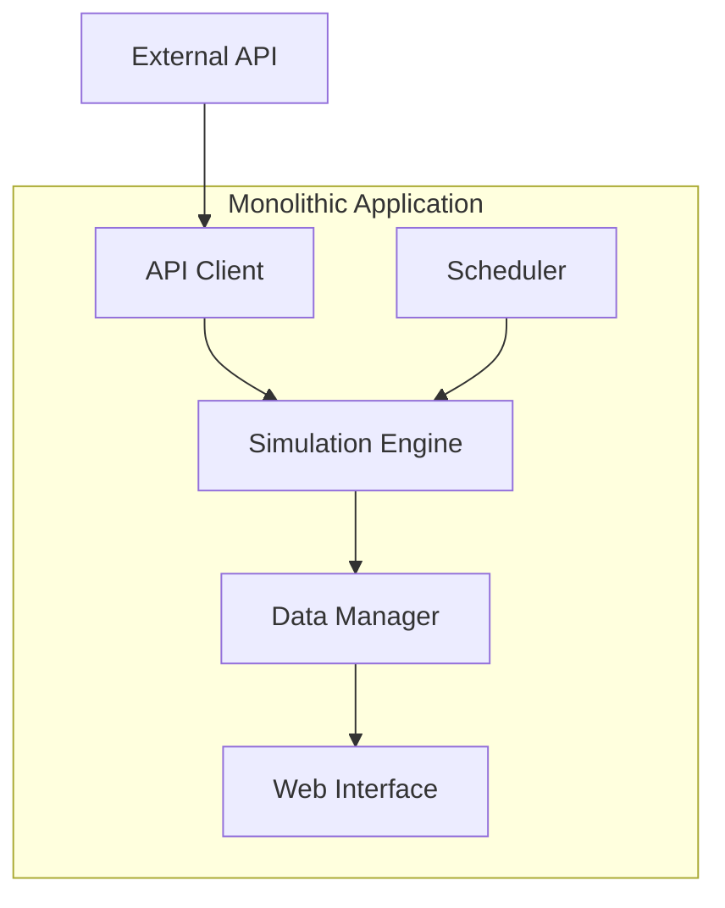
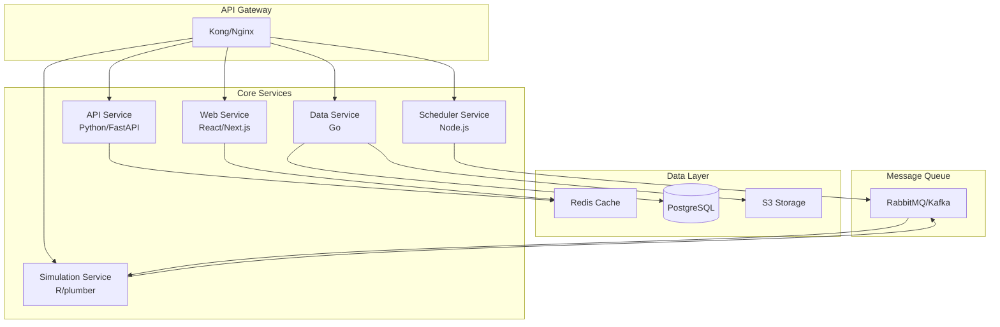
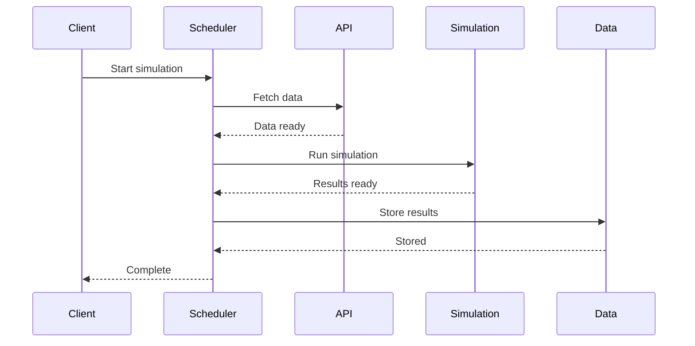

# Microservices Architecture

Detailed design for the League Simulator microservices architecture.

## Current Monolithic Architecture



## Proposed Microservices Architecture



## Service Definitions

### 1. Scheduler Service

**Purpose**: Manage simulation schedules and triggers

**Technology**: Node.js with Bull queue

**API Endpoints**:
```yaml
/api/v1/scheduler:
  GET /schedules - List all schedules
  POST /schedules - Create new schedule
  PUT /schedules/{id} - Update schedule
  DELETE /schedules/{id} - Delete schedule
  POST /trigger - Manual trigger
```

**Implementation**:
```javascript
// scheduler-service/index.js
const Bull = require('bull');
const simulationQueue = new Bull('simulations');

// Schedule job
const scheduleSimulation = async (league, time) => {
  await simulationQueue.add('simulate', 
    { league, timestamp: new Date() },
    { 
      repeat: { cron: time },
      removeOnComplete: true 
    }
  );
};

// Process scheduled jobs
simulationQueue.process('simulate', async (job) => {
  const { league } = job.data;
  await axios.post('http://simulation-service/simulate', { league });
});
```

### 2. API Service

**Purpose**: Handle external API integrations

**Technology**: Python with FastAPI

**API Endpoints**:
```yaml
/api/v1/football:
  GET /teams/{league_id} - Get teams
  GET /fixtures/{league_id} - Get fixtures
  GET /results/{league_id} - Get match results
  GET /standings/{league_id} - Get standings
```

**Implementation**:
```python
# api-service/main.py
from fastapi import FastAPI, HTTPException
from typing import List
import httpx
import redis

app = FastAPI()
cache = redis.Redis(host='redis', port=6379)

@app.get("/api/v1/football/teams/{league_id}")
async def get_teams(league_id: int) -> List[dict]:
    # Check cache first
    cached = cache.get(f"teams:{league_id}")
    if cached:
        return json.loads(cached)
    
    # Fetch from API
    async with httpx.AsyncClient() as client:
        response = await client.get(
            f"https://api-football.com/teams",
            headers={"X-RapidAPI-Key": os.getenv("RAPIDAPI_KEY")},
            params={"league": league_id}
        )
    
    if response.status_code != 200:
        raise HTTPException(status_code=response.status_code)
    
    teams = response.json()["response"]
    
    # Cache for 1 hour
    cache.setex(f"teams:{league_id}", 3600, json.dumps(teams))
    
    return teams
```

### 3. Simulation Service

**Purpose**: Run Monte Carlo simulations

**Technology**: R with plumber API

**API Endpoints**:
```yaml
/api/v1/simulation:
  POST /simulate - Run simulation
  GET /status/{job_id} - Check job status
  GET /results/{job_id} - Get results
```

**Implementation**:
```r
# simulation-service/api.R
library(plumber)
library(future)
library(promises)

#* @apiTitle League Simulation API
#* @apiVersion 1.0.0

# Simulation queue
simulation_jobs <- list()

#* Run simulation
#* @param league_id League ID
#* @param season Season year
#* @param iterations Number of iterations
#* @post /simulate
function(league_id, season = 2025, iterations = 10000) {
  job_id <- uuid::UUIDgenerate()
  
  # Run async
  future_promise({
    source("simulationsCPP.R")
    results <- run_simulation(league_id, season, iterations)
    saveRDS(results, paste0("results/", job_id, ".rds"))
    results
  }) %...>% {
    simulation_jobs[[job_id]] <<- list(
      status = "completed",
      result_file = paste0("results/", job_id, ".rds")
    )
  } %...!% {
    simulation_jobs[[job_id]] <<- list(
      status = "failed",
      error = as.character(.)
    )
  }
  
  simulation_jobs[[job_id]] <<- list(status = "running")
  
  list(job_id = job_id, status = "started")
}

#* Get simulation status
#* @param job_id Job ID
#* @get /status/<job_id>
function(job_id) {
  if (!job_id %in% names(simulation_jobs)) {
    list(error = "Job not found")
  } else {
    simulation_jobs[[job_id]]
  }
}
```

### 4. Data Service

**Purpose**: Manage data persistence and retrieval

**Technology**: Go with GORM

**API Endpoints**:
```yaml
/api/v1/data:
  GET /teams - List teams
  PUT /teams/{id}/elo - Update ELO
  GET /simulations - List simulations
  POST /simulations - Store results
```

**Implementation**:
```go
// data-service/main.go
package main

import (
    "github.com/gin-gonic/gin"
    "gorm.io/gorm"
)

type Team struct {
    ID        uint    `json:"id"`
    Name      string  `json:"name"`
    LeagueID  uint    `json:"league_id"`
    EloRating float64 `json:"elo_rating"`
}

type SimulationResult struct {
    ID       uint   `json:"id"`
    LeagueID uint   `json:"league_id"`
    Season   int    `json:"season"`
    Results  string `json:"results"` // JSON blob
}

func main() {
    r := gin.Default()
    
    r.GET("/api/v1/data/teams", getTeams)
    r.PUT("/api/v1/data/teams/:id/elo", updateElo)
    r.POST("/api/v1/data/simulations", storeSimulation)
    
    r.Run(":8080")
}

func getTeams(c *gin.Context) {
    var teams []Team
    db.Find(&teams)
    c.JSON(200, teams)
}

func updateElo(c *gin.Context) {
    var update struct {
        EloRating float64 `json:"elo_rating"`
    }
    
    if err := c.BindJSON(&update); err != nil {
        c.JSON(400, gin.H{"error": err.Error()})
        return
    }
    
    db.Model(&Team{}).Where("id = ?", c.Param("id")).
        Update("elo_rating", update.EloRating)
    
    c.JSON(200, gin.H{"status": "updated"})
}
```

### 5. Web Service

**Purpose**: Modern web interface

**Technology**: React with Next.js

**Features**:
- Server-side rendering
- Real-time updates
- Progressive web app
- API integration

**Implementation**:
```typescript
// web-service/pages/api/standings.ts
import type { NextApiRequest, NextApiResponse } from 'next'
import Redis from 'ioredis'

const redis = new Redis({
  host: process.env.REDIS_HOST,
  port: 6379
})

export default async function handler(
  req: NextApiRequest,
  res: NextApiResponse
) {
  const { league } = req.query
  
  // Check cache
  const cached = await redis.get(`standings:${league}`)
  if (cached) {
    return res.status(200).json(JSON.parse(cached))
  }
  
  // Fetch from data service
  const response = await fetch(
    `http://data-service/api/v1/data/simulations?league=${league}`
  )
  const data = await response.json()
  
  // Cache for 5 minutes
  await redis.setex(`standings:${league}`, 300, JSON.stringify(data))
  
  res.status(200).json(data)
}
```

## Inter-Service Communication

### Synchronous Communication

REST APIs for direct service-to-service calls:

```yaml
Service Mesh Configuration:
  - Circuit breakers
  - Retry policies
  - Timeout settings
  - Load balancing
```

### Asynchronous Communication

Message queues for decoupled processing:

```python
# Producer
import pika

connection = pika.BlockingConnection(
    pika.ConnectionParameters('rabbitmq')
)
channel = connection.channel()

channel.queue_declare(queue='simulations')

channel.basic_publish(
    exchange='',
    routing_key='simulations',
    body=json.dumps({
        'league_id': 78,
        'season': 2025,
        'iterations': 10000
    })
)
```

```python
# Consumer
def callback(ch, method, properties, body):
    data = json.loads(body)
    # Process simulation
    run_simulation(data['league_id'], data['season'])
    
channel.basic_consume(
    queue='simulations',
    on_message_callback=callback,
    auto_ack=True
)
```

## Service Discovery

### Kubernetes Service Discovery

```yaml
apiVersion: v1
kind: Service
metadata:
  name: simulation-service
  labels:
    app: simulation
spec:
  ports:
  - port: 8000
    name: http
  selector:
    app: simulation
---
apiVersion: v1
kind: Service
metadata:
  name: data-service
  labels:
    app: data
spec:
  ports:
  - port: 8080
    name: http
  selector:
    app: data
```

### Environment-based Discovery

```bash
# Docker Compose
SIMULATION_SERVICE_HOST=simulation-service
SIMULATION_SERVICE_PORT=8000

DATA_SERVICE_HOST=data-service
DATA_SERVICE_PORT=8080
```

## Data Consistency

### Distributed Transactions

Using Saga pattern for cross-service transactions:



### Event Sourcing

```python
# Event store
events = [
    {"type": "SimulationStarted", "league": 78, "timestamp": "..."},
    {"type": "DataFetched", "league": 78, "teams": 18, "timestamp": "..."},
    {"type": "SimulationCompleted", "league": 78, "iterations": 10000, "timestamp": "..."},
    {"type": "ResultsStored", "league": 78, "file": "results.rds", "timestamp": "..."}
]
```

## Deployment Strategy

### Container Orchestration

```yaml
# kubernetes/simulation-deployment.yaml
apiVersion: apps/v1
kind: Deployment
metadata:
  name: simulation-service
spec:
  replicas: 3
  selector:
    matchLabels:
      app: simulation
  template:
    metadata:
      labels:
        app: simulation
    spec:
      containers:
      - name: simulation
        image: league-simulator/simulation:latest
        resources:
          requests:
            memory: "2Gi"
            cpu: "1"
          limits:
            memory: "4Gi"
            cpu: "2"
        env:
        - name: REDIS_HOST
          value: redis-service
        - name: RABBITMQ_HOST
          value: rabbitmq-service
```

### Service Mesh

Using Istio for advanced traffic management:

```yaml
# istio/virtual-service.yaml
apiVersion: networking.istio.io/v1beta1
kind: VirtualService
metadata:
  name: simulation-service
spec:
  hosts:
  - simulation-service
  http:
  - match:
    - headers:
        canary:
          exact: "true"
    route:
    - destination:
        host: simulation-service
        subset: canary
      weight: 10
    - destination:
        host: simulation-service
        subset: stable
      weight: 90
```

## Monitoring and Tracing

### Distributed Tracing

Using OpenTelemetry:

```python
from opentelemetry import trace
from opentelemetry.exporter.jaeger import JaegerExporter

tracer = trace.get_tracer(__name__)

@app.post("/simulate")
async def simulate(request: SimulationRequest):
    with tracer.start_as_current_span("simulation") as span:
        span.set_attribute("league.id", request.league_id)
        span.set_attribute("simulation.iterations", request.iterations)
        
        # Fetch data
        with tracer.start_as_current_span("fetch_data"):
            data = await fetch_league_data(request.league_id)
        
        # Run simulation
        with tracer.start_as_current_span("run_simulation"):
            results = await run_simulation(data, request.iterations)
        
        return results
```

### Service Metrics

```python
from prometheus_client import Counter, Histogram, Gauge

simulation_counter = Counter(
    'simulations_total',
    'Total simulations',
    ['league', 'status']
)

simulation_duration = Histogram(
    'simulation_duration_seconds',
    'Simulation duration',
    ['league']
)

active_simulations = Gauge(
    'active_simulations',
    'Currently running simulations'
)
```

## Migration Strategy

### Phase 1: Extract API Service
- Move API calls to dedicated service
- Implement caching layer
- Update monolith to use API service

### Phase 2: Extract Data Service
- Migrate from CSV to PostgreSQL
- Implement data API
- Update services to use data service

### Phase 3: Extract Simulation Service
- Create simulation API
- Implement job queue
- Scale horizontally

### Phase 4: Modernize Web Interface
- Build React frontend
- Implement real-time updates
- Deploy as separate service

### Phase 5: Complete Migration
- Decompose scheduler
- Remove monolithic components
- Full microservices architecture

## Related Documentation

- [Architecture Overview](overview.md)
- [Data Flow](data-flow.md)
- [API Reference](api-reference.md)
- [Deployment Guide](../deployment/production.md)