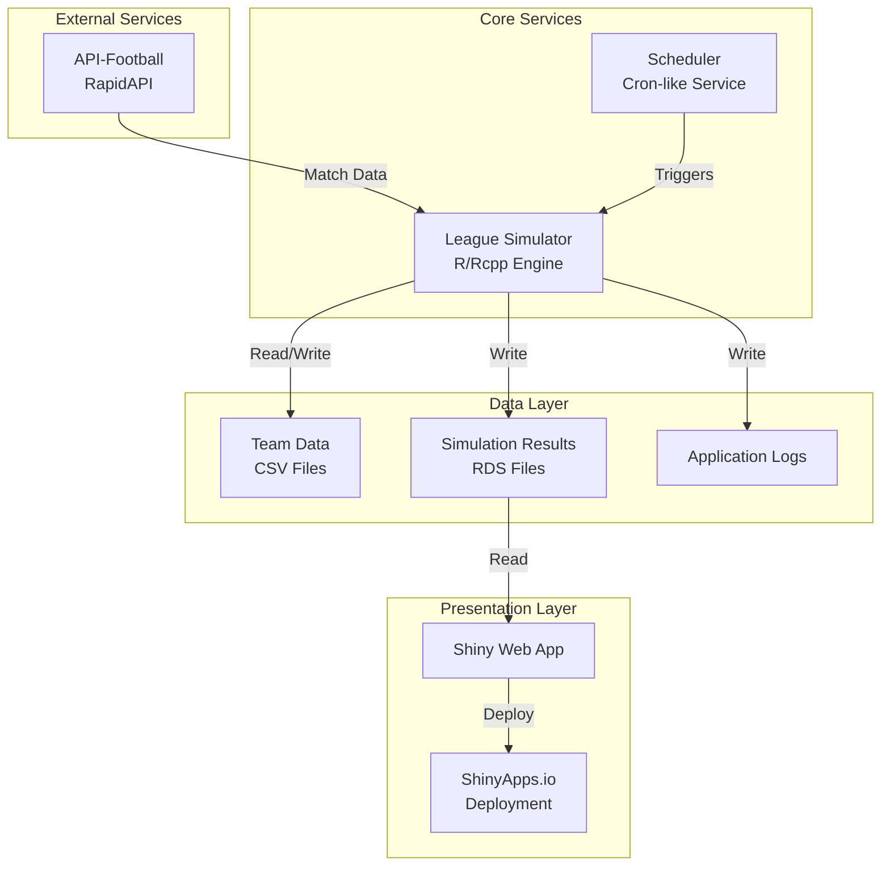
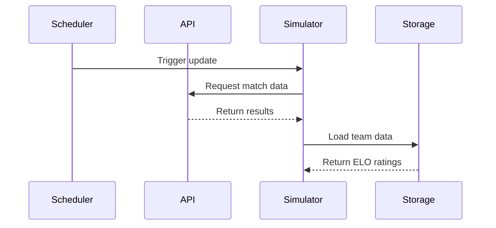
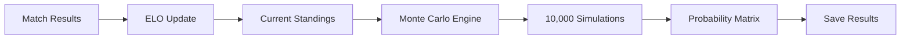
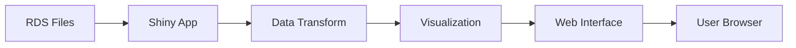
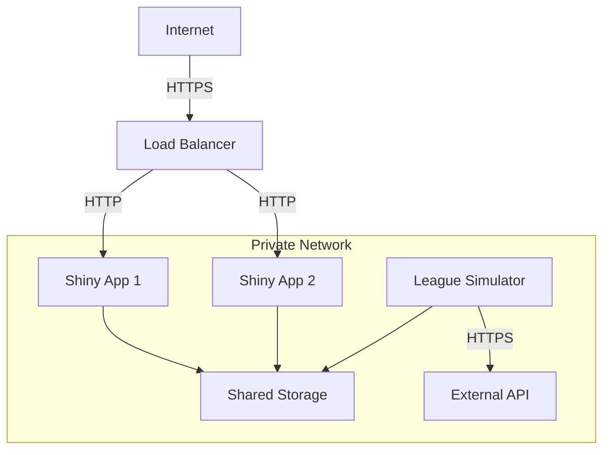
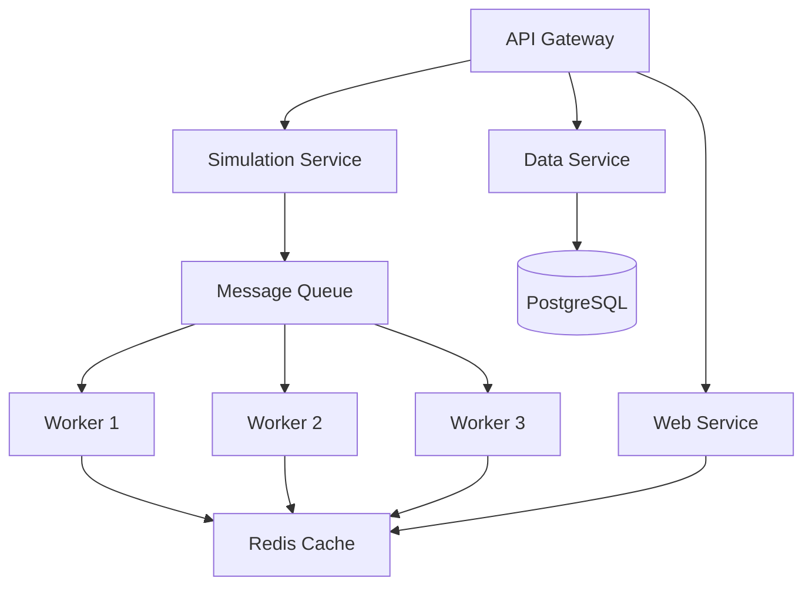

# League Simulator Architecture Overview

High-level system architecture and design principles.

## System Architecture



## Core Components

### 1. League Simulator Engine

The heart of the system, built with R and Rcpp for performance.

**Key Features:**
- Monte Carlo simulations (10,000 iterations default)
- ELO-based match predictions
- Parallel processing capabilities
- Memory-efficient data structures

**Technology Stack:**
- R 4.2+ for orchestration
- Rcpp for performance-critical calculations
- OpenMP for parallelization

### 2. Scheduler Service

Automated scheduling system for regular updates.

**Schedule:**
- Active hours: 14:45 - 23:00 Berlin time
- Update times: 15:00, 15:30, 16:00, 17:30, 18:00, 21:00, 23:00
- Sleep period: 3 hours after last update

**Features:**
- Timezone-aware scheduling
- Automatic retries on failure
- Graceful shutdown handling

### 3. Data Management

Efficient data storage and retrieval system.

**Data Types:**
- **Team Data**: CSV files with ELO ratings
- **Match Results**: Retrieved from API
- **Simulation Output**: RDS files for R efficiency
- **Logs**: Structured logging for debugging

### 4. Web Interface

Interactive visualization using Shiny.

**Features:**
- Real-time probability heatmaps
- Final standings predictions
- Historical trend analysis
- Mobile-responsive design

## Design Principles

### 1. Modularity

```
RCode/
├── Core Modules (simulation logic)
├── API Modules (external integrations)
├── Helper Modules (utilities)
└── Scheduler Modules (automation)
```

Each module has a single responsibility and clear interfaces.

### 2. Performance Optimization

- **Rcpp Integration**: 100x speedup for critical paths
- **Vectorized Operations**: Leverage R's strengths
- **Lazy Loading**: Load data only when needed
- **Caching**: Reuse expensive calculations

### 3. Fault Tolerance

```r
# Example: Resilient API calls
safe_api_call <- function(endpoint, max_retries = 3) {
  for (i in 1:max_retries) {
    result <- tryCatch({
      httr::GET(endpoint)
    }, error = function(e) NULL)
    
    if (!is.null(result) && result$status_code == 200) {
      return(result)
    }
    Sys.sleep(2^i)  # Exponential backoff
  }
  stop("API call failed after retries")
}
```

### 4. Scalability

- **Horizontal Scaling**: Multiple simulator instances
- **Vertical Scaling**: Leverage more CPU cores
- **Data Partitioning**: Process leagues independently

## Data Flow

### 1. Input Phase



### 2. Processing Phase



### 3. Output Phase



## Technology Stack

### Backend

| Component | Technology | Purpose |
|-----------|------------|---------|
| Core Engine | R 4.2+ | Main programming language |
| Performance | Rcpp | C++ integration for speed |
| API Client | httr | HTTP requests |
| Data Processing | dplyr, tidyr | Data manipulation |
| Scheduling | cronR (concept) | Time-based execution |

### Frontend

| Component | Technology | Purpose |
|-----------|------------|---------|
| Web Framework | Shiny | Interactive web apps |
| Visualization | ggplot2 | Data visualization |
| Tables | DT | Interactive tables |
| Styling | CSS/Bootstrap | UI styling |

### Infrastructure

| Component | Technology | Purpose |
|-----------|------------|---------|
| Containerization | Docker | Application packaging |
| Orchestration | Docker Compose | Multi-container apps |
| CI/CD | GitHub Actions | Automation |
| Monitoring | Custom R metrics | Performance tracking |

## Security Architecture

### API Security

```r
# Secure API key handling
get_api_key <- function() {
  key <- Sys.getenv("RAPIDAPI_KEY")
  if (key == "") {
    stop("API key not found in environment")
  }
  return(key)
}
```

### Data Security

- Environment variables for secrets
- Read-only volume mounts
- Principle of least privilege
- No hardcoded credentials

### Network Security



## Performance Characteristics

### Simulation Performance

| Metric | Value | Notes |
|--------|-------|-------|
| Single simulation | ~50ms | One complete season |
| 10,000 iterations | ~8-10 minutes | Full probability calculation |
| Memory usage | ~2GB peak | During simulation |
| CPU usage | 100% (multi-core) | Parallel processing |

### API Performance

| Endpoint | Response Time | Rate Limit |
|----------|---------------|------------|
| Team data | ~500ms | 100/hour |
| Match results | ~1s | 100/hour |
| League standings | ~800ms | 100/hour |

## Deployment Architecture

### Development

```
Local Machine
├── Docker Compose
├── Hot reload enabled
├── Debug logging
└── Mock data available
```

### Production

```
Cloud Provider
├── Kubernetes Cluster
│   ├── League Simulator Pods
│   ├── Shiny App Pods
│   └── Redis Cache
├── PostgreSQL Database
├── S3-compatible Storage
└── CDN for Static Assets
```

## Monitoring and Observability

### Metrics Collection

```r
# Application metrics
list(
  simulations_total = counter,
  simulation_duration_seconds = histogram,
  api_requests_total = counter,
  api_errors_total = counter,
  elo_updates_total = counter
)
```

### Log Aggregation

```
Application Logs → File System → Log Shipper → Central Log Store
                                                  ↓
                                            Log Analysis
```

### Health Checks

```r
# Health check endpoint
health_check <- function() {
  checks <- list(
    api = test_api_connection(),
    data = file.exists("RCode/TeamList_2025.csv"),
    write = can_write_results()
  )
  
  list(
    status = all(unlist(checks)),
    checks = checks,
    timestamp = Sys.time()
  )
}
```

## Future Architecture Considerations

### Microservices Migration



### Event-Driven Architecture

- Publish match results to event stream
- Trigger simulations on events
- Real-time updates via WebSockets
- Async processing for better scalability

## Related Documentation

- [Microservices Design](microservices.md)
- [Data Flow Details](data-flow.md)
- [API Reference](api-reference.md)
- [Performance Tuning](../troubleshooting/performance.md)