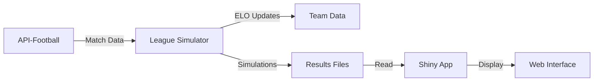

# Detailed Deployment Guide

Comprehensive step-by-step deployment guide for the League Simulator system.

## Table of Contents

1. [System Requirements](#system-requirements)
2. [Pre-deployment Checklist](#pre-deployment-checklist)
3. [Installation Steps](#installation-steps)
4. [Configuration](#configuration)
5. [Service Architecture](#service-architecture)
6. [Deployment Verification](#deployment-verification)
7. [Post-deployment Tasks](#post-deployment-tasks)

## System Requirements

### Hardware Requirements

- **CPU**: 2+ cores (4+ recommended for production)
- **RAM**: 4GB minimum (8GB recommended)
- **Storage**: 10GB available space
- **Network**: Stable internet connection for API calls

### Software Requirements

- **Operating System**: Linux (Ubuntu 20.04+), macOS, or Windows with WSL2
- **Docker**: Version 20.10+
- **Docker Compose**: Version 2.0+
- **Git**: Version 2.25+

## Pre-deployment Checklist

- [ ] Docker and Docker Compose installed and running
- [ ] RapidAPI account with api-football subscription
- [ ] ShinyApps.io account (optional for web deployment)
- [ ] GitHub access to clone repository
- [ ] Sufficient disk space (10GB+)
- [ ] Network access to Docker Hub and RapidAPI

## Installation Steps

### Step 1: Clone Repository

```bash
# Clone the repository
git clone https://github.com/chrisschwer/League-Simulator-Update.git
cd League-Simulator-Update

# Verify repository integrity
git status
ls -la
```

### Step 2: Configure Environment

Create a `.env` file with your configuration:

```bash
# Create .env from template
cp .env.example .env

# Edit with your values
nano .env
```

Required environment variables:

```env
# API Configuration
RAPIDAPI_KEY=your_rapidapi_key_here

# ShinyApps.io Deployment (optional)
SHINYAPPS_IO_NAME=your_username
SHINYAPPS_IO_TOKEN=your_token
SHINYAPPS_IO_SECRET=your_secret

# Simulation Configuration
SEASON=2025
DURATION=480  # Minutes between update cycles

# Timezone Configuration
TZ=Europe/Berlin
```

### Step 3: Build Docker Images

```bash
# Build all services
docker-compose build --no-cache

# Or build specific services
docker-compose build league-simulator
docker-compose build shiny-app
```

Expected output:
```
[+] Building 245.3s (15/15) FINISHED
 => [league-simulator] exporting to image
 => => naming to docker.io/library/league-simulator:latest
```

### Step 4: Initialize Database

```bash
# Create required directories
mkdir -p logs ShinyApp/data

# Initialize team data
docker-compose run --rm league-simulator Rscript -e "
  source('RCode/leagueSimulatorCPP.R')
  # Verify team lists exist
  file.exists('RCode/TeamList_2025.csv')
"
```

### Step 5: Start Services

```bash
# Start all services in detached mode
docker-compose up -d

# Monitor startup logs
docker-compose logs -f

# Verify all services are running
docker-compose ps
```

## Configuration

### Docker Compose Configuration

The `docker-compose.yml` defines the service architecture:

```yaml
version: '3.8'

services:
  league-simulator:
    build:
      context: .
      dockerfile: Dockerfile.league
    environment:
      - RAPIDAPI_KEY=${RAPIDAPI_KEY}
      - SEASON=${SEASON}
      - DURATION=${DURATION}
      - TZ=${TZ}
    volumes:
      - ./logs:/app/logs
      - ./ShinyApp/data:/app/ShinyApp/data
    restart: unless-stopped

  shiny-app:
    build:
      context: .
      dockerfile: Dockerfile.shiny
    ports:
      - "3838:3838"
    volumes:
      - ./ShinyApp/data:/app/ShinyApp/data:ro
    restart: unless-stopped
```

### Application Configuration

#### Update Schedule

Edit `RCode/updateScheduler.R` to modify simulation times:

```r
# Default schedule (Berlin time)
update_times <- c("15:00", "15:30", "16:00", "17:30", "18:00", "21:00", "23:00")
```

#### League Configuration

Supported leagues in `RCode/update_all_leagues_loop.R`:

```r
leagues <- list(
  list(id = 78, name = "Bundesliga"),
  list(id = 79, name = "2. Bundesliga"),
  list(id = 80, name = "3. Liga")
)
```

## Service Architecture

### League Simulator Service

- **Purpose**: Runs scheduled simulations and updates
- **Schedule**: Active 14:45-23:00 Berlin time
- **Output**: Simulation results to `/ShinyApp/data/`
- **Logs**: Written to `/logs/` directory

### Shiny App Service

- **Purpose**: Web interface for viewing results
- **Port**: 3838 (configurable)
- **Data**: Reads from shared volume
- **Access**: http://localhost:3838

### Data Flow



## Deployment Verification

### Step 1: Check Service Health

```bash
# All services should be "Up"
docker-compose ps

# Check resource usage
docker stats
```

### Step 2: Verify API Connection

```bash
# Test API connectivity
docker-compose exec league-simulator Rscript test_api_connection.R

# Expected output:
# ✓ API connection successful
# ✓ Retrieved 18 teams for Bundesliga
```

### Step 3: Test Simulation

```bash
# Run single update cycle
docker-compose exec league-simulator Rscript run_single_update_2025.R

# Check output files
ls -la ShinyApp/data/
```

### Step 4: Verify Web Interface

```bash
# Local deployment
curl http://localhost:3838

# Or open in browser
open http://localhost:3838
```

## Post-deployment Tasks

### 1. Configure Monitoring

```bash
# Set up log rotation
cat > /etc/logrotate.d/league-simulator << EOF
/path/to/League-Simulator-Update/logs/*.log {
    daily
    rotate 7
    compress
    missingok
    notifempty
}
EOF
```

### 2. Set Up Backups

```bash
# Backup script
cat > backup.sh << 'EOF'
#!/bin/bash
BACKUP_DIR="/backups/league-simulator/$(date +%Y%m%d)"
mkdir -p "$BACKUP_DIR"
cp -r ShinyApp/data "$BACKUP_DIR/"
cp -r RCode/TeamList_*.csv "$BACKUP_DIR/"
tar -czf "$BACKUP_DIR.tar.gz" "$BACKUP_DIR"
rm -rf "$BACKUP_DIR"
EOF

chmod +x backup.sh
```

### 3. Configure Alerts

```bash
# Health check script
cat > healthcheck.sh << 'EOF'
#!/bin/bash
if ! docker-compose ps | grep -q "Up"; then
    echo "League Simulator services down!" | mail -s "Alert" admin@example.com
fi
EOF

# Add to crontab
crontab -e
# */5 * * * * /path/to/healthcheck.sh
```

### 4. Security Hardening

- Change default ports
- Enable firewall rules
- Set up SSL/TLS for Shiny app
- Implement API rate limiting
- Regular security updates

## Troubleshooting

See [Troubleshooting Guide](../troubleshooting/common-issues.md) for detailed solutions.

## Related Documentation

- [Quick Start Guide](quick-start.md) - 5-minute deployment
- [Production Deployment](production.md) - Production best practices
- [Local Development](local-development.md) - Developer setup
- [Architecture Overview](../architecture/overview.md) - System design