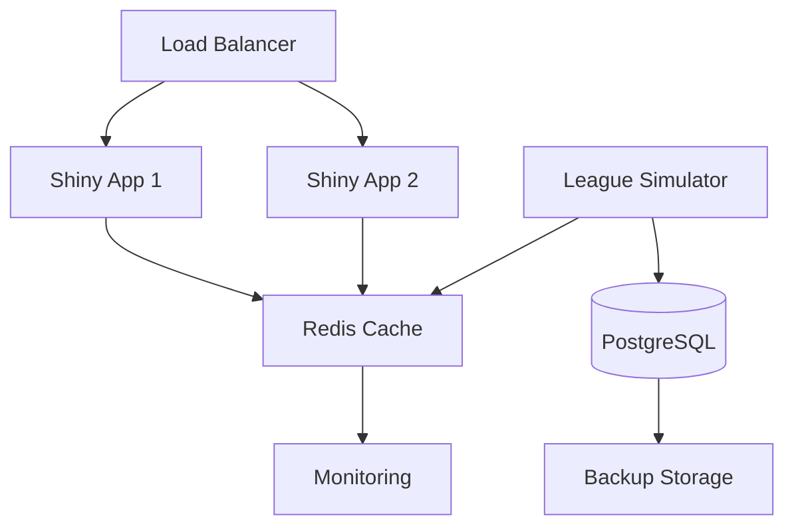

# Production Deployment Guide

Enterprise-grade deployment guide with security hardening and best practices.

## Overview

This guide covers deploying the League Simulator in a production environment with:
- High availability
- Security hardening
- Performance optimization
- Monitoring and alerting
- Disaster recovery

## Production Architecture



## Infrastructure Requirements

### Minimum Production Setup

- **Application Servers**: 2x (4 vCPU, 8GB RAM)
- **Database Server**: 1x (2 vCPU, 4GB RAM, 100GB SSD)
- **Cache Server**: 1x (2 vCPU, 4GB RAM)
- **Load Balancer**: Managed service recommended
- **Storage**: S3-compatible for backups

### Recommended Setup

- **Kubernetes Cluster**: 3+ nodes
- **Container Registry**: Private registry
- **CI/CD Pipeline**: GitLab CI or GitHub Actions
- **Monitoring Stack**: Prometheus + Grafana
- **Log Management**: ELK Stack or Loki

## Pre-Production Checklist

- [ ] SSL certificates obtained
- [ ] Domain configured
- [ ] Firewall rules defined
- [ ] Backup strategy documented
- [ ] Monitoring endpoints defined
- [ ] Security scan completed
- [ ] Load testing performed
- [ ] Disaster recovery plan tested

## Security Hardening

### 1. Environment Security

```bash
# Generate secure secrets
openssl rand -base64 32 > shiny_secret
openssl rand -base64 32 > db_password

# Create production env file
cat > .env.production << EOF
# API Configuration (encrypted at rest)
RAPIDAPI_KEY=$(vault kv get -field=api_key secret/league-simulator)

# Database Configuration
DB_HOST=postgres.internal
DB_PORT=5432
DB_NAME=league_simulator
DB_USER=league_app
DB_PASSWORD=$(cat db_password)

# Redis Configuration
REDIS_HOST=redis.internal
REDIS_PORT=6379
REDIS_PASSWORD=$(openssl rand -base64 32)

# Application Security
SESSION_SECRET=$(cat shiny_secret)
ENABLE_HTTPS=true
SECURE_COOKIES=true

# Monitoring
ENABLE_METRICS=true
METRICS_PORT=9090
EOF
```

### 2. Docker Security

Create `Dockerfile.production`:

```dockerfile
# Multi-stage build for minimal attack surface
FROM rocker/r-ver:4.2.3 AS builder

# Install only required system packages
RUN apt-get update && apt-get install -y --no-install-recommends \
    libcurl4-openssl-dev \
    libssl-dev \
    libxml2-dev \
    && rm -rf /var/lib/apt/lists/*

# Copy and install R packages
WORKDIR /build
COPY renv.lock .
RUN R -e "install.packages('renv')" && \
    R -e "renv::restore()"

# Production stage
FROM rocker/r-ver:4.2.3-slim

# Create non-root user
RUN useradd -m -u 1000 -s /bin/bash appuser

# Copy only necessary files
COPY --from=builder /usr/local/lib/R /usr/local/lib/R
COPY --chown=appuser:appuser . /app

# Security settings
USER appuser
WORKDIR /app

# Health check
HEALTHCHECK --interval=30s --timeout=3s --start-period=5s --retries=3 \
  CMD Rscript -e "cat('OK')" || exit 1

ENTRYPOINT ["Rscript", "RCode/updateScheduler.R"]
```

### 3. Network Security

```yaml
# docker-compose.production.yml
version: '3.8'

networks:
  frontend:
    driver: bridge
  backend:
    driver: bridge
    internal: true

services:
  league-simulator:
    image: registry.company.com/league-simulator:${VERSION}
    networks:
      - backend
    deploy:
      resources:
        limits:
          cpus: '2'
          memory: 4G
    security_opt:
      - no-new-privileges:true
    read_only: true
    tmpfs:
      - /tmp
      - /var/tmp

  shiny-app:
    image: registry.company.com/shiny-app:${VERSION}
    networks:
      - frontend
      - backend
    deploy:
      replicas: 2
    security_opt:
      - no-new-privileges:true
```

## Kubernetes Deployment

### 1. Create Namespace and Secrets

```bash
# Create namespace
kubectl create namespace league-simulator

# Create secrets
kubectl create secret generic api-secrets \
  --from-env-file=.env.production \
  -n league-simulator
```

### 2. Deploy Application

```yaml
# k8s/production-deployment.yaml
apiVersion: apps/v1
kind: Deployment
metadata:
  name: league-simulator
  namespace: league-simulator
spec:
  replicas: 1
  selector:
    matchLabels:
      app: league-simulator
  template:
    metadata:
      labels:
        app: league-simulator
    spec:
      serviceAccountName: league-simulator
      securityContext:
        runAsNonRoot: true
        runAsUser: 1000
        fsGroup: 1000
      containers:
      - name: league-simulator
        image: registry.company.com/league-simulator:latest
        imagePullPolicy: Always
        resources:
          requests:
            memory: "2Gi"
            cpu: "1"
          limits:
            memory: "4Gi"
            cpu: "2"
        envFrom:
        - secretRef:
            name: api-secrets
        volumeMounts:
        - name: data
          mountPath: /app/data
        securityContext:
          allowPrivilegeEscalation: false
          readOnlyRootFilesystem: true
          capabilities:
            drop:
            - ALL
      volumes:
      - name: data
        persistentVolumeClaim:
          claimName: league-data-pvc
---
apiVersion: v1
kind: Service
metadata:
  name: league-simulator
  namespace: league-simulator
spec:
  selector:
    app: league-simulator
  ports:
  - port: 80
    targetPort: 3838
```

### 3. Configure Ingress

```yaml
# k8s/ingress.yaml
apiVersion: networking.k8s.io/v1
kind: Ingress
metadata:
  name: league-simulator-ingress
  namespace: league-simulator
  annotations:
    cert-manager.io/cluster-issuer: letsencrypt-prod
    nginx.ingress.kubernetes.io/rate-limit: "100"
spec:
  tls:
  - hosts:
    - league-simulator.company.com
    secretName: league-simulator-tls
  rules:
  - host: league-simulator.company.com
    http:
      paths:
      - path: /
        pathType: Prefix
        backend:
          service:
            name: shiny-app
            port:
              number: 3838
```

## Database Setup

### PostgreSQL Configuration

```sql
-- Create database and user
CREATE DATABASE league_simulator;
CREATE USER league_app WITH ENCRYPTED PASSWORD 'secure_password';
GRANT CONNECT ON DATABASE league_simulator TO league_app;

-- Create schema
\c league_simulator
CREATE SCHEMA IF NOT EXISTS league_data AUTHORIZATION league_app;

-- Create tables
CREATE TABLE league_data.teams (
    id INTEGER PRIMARY KEY,
    name VARCHAR(100) NOT NULL,
    league_id INTEGER NOT NULL,
    elo_rating DECIMAL(10,2) DEFAULT 1500,
    updated_at TIMESTAMP DEFAULT CURRENT_TIMESTAMP
);

CREATE TABLE league_data.match_results (
    id SERIAL PRIMARY KEY,
    home_team_id INTEGER REFERENCES league_data.teams(id),
    away_team_id INTEGER REFERENCES league_data.teams(id),
    home_score INTEGER,
    away_score INTEGER,
    match_date DATE,
    created_at TIMESTAMP DEFAULT CURRENT_TIMESTAMP
);

CREATE TABLE league_data.simulations (
    id SERIAL PRIMARY KEY,
    league_id INTEGER NOT NULL,
    season INTEGER NOT NULL,
    iteration INTEGER NOT NULL,
    results JSONB,
    created_at TIMESTAMP DEFAULT CURRENT_TIMESTAMP
);

-- Create indexes
CREATE INDEX idx_teams_league ON league_data.teams(league_id);
CREATE INDEX idx_matches_date ON league_data.match_results(match_date);
CREATE INDEX idx_simulations_created ON league_data.simulations(created_at);
```

## Monitoring Setup

### 1. Prometheus Configuration

```yaml
# prometheus.yml
global:
  scrape_interval: 30s
  evaluation_interval: 30s

scrape_configs:
  - job_name: 'league-simulator'
    static_configs:
      - targets: ['league-simulator:9090']
    metrics_path: '/metrics'
    
  - job_name: 'shiny-apps'
    static_configs:
      - targets: ['shiny-1:9090', 'shiny-2:9090']
```

### 2. Application Metrics

Add to R code:

```r
# RCode/metrics.R
library(promR)

# Initialize metrics
simulation_counter <- Counter$new(
  "league_simulations_total",
  "Total number of simulations run",
  label_names = c("league", "status")
)

api_histogram <- Histogram$new(
  "api_request_duration_seconds",
  "API request duration",
  label_names = c("endpoint"),
  buckets = c(0.1, 0.5, 1, 2, 5, 10)
)

# Use in code
simulation_counter$inc(labels = list(league = "Bundesliga", status = "success"))
```

### 3. Alerting Rules

```yaml
# alerts.yml
groups:
  - name: league-simulator
    rules:
    - alert: HighAPIErrorRate
      expr: rate(api_errors_total[5m]) > 0.1
      for: 5m
      labels:
        severity: warning
      annotations:
        summary: "High API error rate"
        
    - alert: SimulationFailures
      expr: rate(simulation_failures_total[15m]) > 0.05
      for: 10m
      labels:
        severity: critical
      annotations:
        summary: "Simulation failures above threshold"
```

## Backup and Recovery

### 1. Automated Backups

```bash
#!/bin/bash
# backup.sh

# Configuration
BACKUP_DIR="/backups/league-simulator"
S3_BUCKET="s3://company-backups/league-simulator"
RETENTION_DAYS=30

# Create backup
DATE=$(date +%Y%m%d_%H%M%S)
BACKUP_PATH="$BACKUP_DIR/$DATE"

# Database backup
pg_dump -h $DB_HOST -U $DB_USER -d $DB_NAME | gzip > "$BACKUP_PATH/database.sql.gz"

# Application data backup
tar -czf "$BACKUP_PATH/app_data.tar.gz" /app/data/

# Upload to S3
aws s3 sync "$BACKUP_PATH" "$S3_BUCKET/$DATE/"

# Clean old backups
find "$BACKUP_DIR" -type d -mtime +$RETENTION_DAYS -exec rm -rf {} \;
aws s3 ls "$S3_BUCKET" | while read -r line; do
  createDate=$(echo $line | awk {'print $1" "$2'})
  createDate=$(date -d "$createDate" +%s)
  olderThan=$(date -d "$RETENTION_DAYS days ago" +%s)
  if [[ $createDate -lt $olderThan ]]; then
    fileName=$(echo $line | awk {'print $4'})
    aws s3 rm "$S3_BUCKET/$fileName"
  fi
done
```

### 2. Recovery Procedure

```bash
#!/bin/bash
# restore.sh

# Select backup
BACKUP_DATE=$1
S3_BUCKET="s3://company-backups/league-simulator"

# Download backup
aws s3 sync "$S3_BUCKET/$BACKUP_DATE/" "/tmp/restore/"

# Restore database
gunzip -c /tmp/restore/database.sql.gz | psql -h $DB_HOST -U $DB_USER -d $DB_NAME

# Restore application data
tar -xzf /tmp/restore/app_data.tar.gz -C /

# Verify restoration
Rscript -e "source('RCode/verify_restoration.R')"
```

## Performance Optimization

### 1. Caching Strategy

```r
# Use Redis for caching
library(redux)
redis <- hiredis()

# Cache simulation results
cache_key <- paste0("simulation:", league_id, ":", season)
cached <- redis$get(cache_key)

if (is.null(cached)) {
  results <- run_simulation(league_id, season)
  redis$setex(cache_key, 3600, serialize(results, NULL))
} else {
  results <- unserialize(cached)
}
```

### 2. Load Balancing

```nginx
# nginx.conf
upstream shiny_backend {
    least_conn;
    server shiny-1:3838 weight=1 max_fails=3 fail_timeout=30s;
    server shiny-2:3838 weight=1 max_fails=3 fail_timeout=30s;
    keepalive 32;
}

server {
    listen 443 ssl http2;
    server_name league-simulator.company.com;
    
    ssl_certificate /etc/ssl/certs/league-simulator.crt;
    ssl_certificate_key /etc/ssl/private/league-simulator.key;
    
    location / {
        proxy_pass http://shiny_backend;
        proxy_http_version 1.1;
        proxy_set_header Upgrade $http_upgrade;
        proxy_set_header Connection "upgrade";
        proxy_read_timeout 20d;
        proxy_buffering off;
    }
}
```

## Deployment Automation

### CI/CD Pipeline

```yaml
# .gitlab-ci.yml
stages:
  - test
  - build
  - deploy

test:
  stage: test
  script:
    - docker build -t test-image -f Dockerfile.test .
    - docker run test-image Rscript tests/testthat.R
    
build:
  stage: build
  script:
    - docker build -t $CI_REGISTRY_IMAGE:$CI_COMMIT_SHA .
    - docker push $CI_REGISTRY_IMAGE:$CI_COMMIT_SHA
    
deploy:
  stage: deploy
  only:
    - main
  script:
    - kubectl set image deployment/league-simulator league-simulator=$CI_REGISTRY_IMAGE:$CI_COMMIT_SHA
    - kubectl rollout status deployment/league-simulator
```

## Production Checklist

### Pre-deployment

- [ ] Security scan passed
- [ ] Load testing completed
- [ ] Backup tested
- [ ] Monitoring configured
- [ ] Runbooks documented
- [ ] Team trained

### Post-deployment

- [ ] SSL certificate valid
- [ ] Health checks passing
- [ ] Metrics flowing
- [ ] Alerts configured
- [ ] Performance baseline established
- [ ] First backup completed

## Related Documentation

- [Monitoring Guide](../operations/monitoring.md)
- [Security Best Practices](../operations/security.md)
- [Disaster Recovery](../operations/backup-recovery.md)
- [Performance Tuning](../troubleshooting/performance.md)