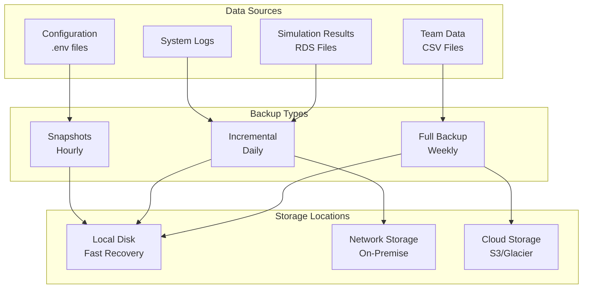

# Backup and Recovery Procedures

Comprehensive guide for data protection and disaster recovery.

## Backup Strategy Overview



## Backup Schedules

### Automated Backup Schedule

| Type | Frequency | Time (CET) | Retention | Storage |
|------|-----------|------------|-----------|---------|
| Snapshot | Hourly | :00 | 24 hours | Local |
| Incremental | Daily | 03:00 | 7 days | Local + NAS |
| Full | Weekly | Sun 02:00 | 4 weeks | Local + Cloud |
| Archive | Monthly | 1st Sun | 1 year | Cloud (Glacier) |

### What Gets Backed Up

```yaml
Critical Data:
  - /RCode/TeamList_*.csv      # Team configurations
  - /ShinyApp/data/*.Rds        # Simulation results
  - /.env*                      # Configuration files
  - /logs/*.log                 # Application logs

System Configuration:
  - docker-compose.yml          # Service definitions
  - Dockerfile*                 # Build configurations
  - /scripts/*.sh              # Operational scripts

Code Repository:
  - Git repository (separate backup via GitHub)
  - Branch protection rules
  - Release tags
```

## Backup Implementation

### 1. Snapshot Backups (Hourly)

```bash
#!/bin/bash
# backup_snapshot.sh
# Run via cron: 0 * * * * /path/to/backup_snapshot.sh

TIMESTAMP=$(date +%Y%m%d_%H%M%S)
SNAPSHOT_DIR="/backups/snapshots/$TIMESTAMP"

# Create snapshot directory
mkdir -p "$SNAPSHOT_DIR"

# Quick copy of critical files
cp -r ShinyApp/data/*.Rds "$SNAPSHOT_DIR/" 2>/dev/null
cp RCode/TeamList_*.csv "$SNAPSHOT_DIR/"
cp .env* "$SNAPSHOT_DIR/" 2>/dev/null

# Create manifest
cat > "$SNAPSHOT_DIR/manifest.txt" << EOF
Snapshot Backup
Created: $(date)
Type: Hourly
Files: $(find "$SNAPSHOT_DIR" -type f | wc -l)
Size: $(du -sh "$SNAPSHOT_DIR" | cut -f1)
EOF

# Cleanup old snapshots (keep last 24)
find /backups/snapshots -maxdepth 1 -type d -mtime +1 -exec rm -rf {} \;

echo "Snapshot backup completed: $SNAPSHOT_DIR"
```

### 2. Incremental Backups (Daily)

```bash
#!/bin/bash
# backup_incremental.sh
# Run via cron: 0 3 * * * /path/to/backup_incremental.sh

DATE=$(date +%Y%m%d)
BACKUP_DIR="/backups/incremental/$DATE"
LAST_BACKUP=$(find /backups/incremental -maxdepth 1 -type d | sort | tail -2 | head -1)

# Create backup directory
mkdir -p "$BACKUP_DIR"

# Use rsync for incremental backup
rsync -av --link-dest="$LAST_BACKUP" \
  --include="*.csv" \
  --include="*.Rds" \
  --include="*.log" \
  --include=".env*" \
  --exclude="*" \
  /app/ "$BACKUP_DIR/"

# Compress logs
find "$BACKUP_DIR" -name "*.log" -exec gzip {} \;

# Sync to NAS
rsync -av "$BACKUP_DIR/" "/mnt/nas/league-simulator/incremental/$DATE/"

# Create backup metadata
cat > "$BACKUP_DIR/backup_info.json" << EOF
{
  "type": "incremental",
  "date": "$DATE",
  "timestamp": "$(date -Iseconds)",
  "size": "$(du -sh "$BACKUP_DIR" | cut -f1)",
  "files": $(find "$BACKUP_DIR" -type f | wc -l),
  "previous_backup": "$LAST_BACKUP"
}
EOF

# Cleanup old backups (keep 7 days)
find /backups/incremental -maxdepth 1 -type d -mtime +7 -exec rm -rf {} \;

echo "Incremental backup completed: $BACKUP_DIR"
```

### 3. Full Backups (Weekly)

```bash
#!/bin/bash
# backup_full.sh
# Run via cron: 0 2 * * 0 /path/to/backup_full.sh

WEEK=$(date +%Y_W%U)
BACKUP_DIR="/backups/full/$WEEK"
BACKUP_FILE="league_simulator_full_$WEEK.tar.gz"

# Create backup directory
mkdir -p "$BACKUP_DIR"

# Stop services for consistency (optional)
# docker-compose stop

# Full backup of application
tar -czf "$BACKUP_DIR/$BACKUP_FILE" \
  --exclude='*.tmp' \
  --exclude='cache/*' \
  /app/RCode \
  /app/ShinyApp \
  /app/scripts \
  /app/logs \
  /app/.env* \
  /app/docker-compose.yml

# Backup Docker images
docker save league-simulator:latest | gzip > "$BACKUP_DIR/docker_images.tar.gz"

# Create database dump (if using PostgreSQL)
# pg_dump -h $DB_HOST -U $DB_USER -d $DB_NAME | gzip > "$BACKUP_DIR/database.sql.gz"

# Calculate checksums
cd "$BACKUP_DIR"
sha256sum * > checksums.sha256

# Upload to cloud storage
aws s3 cp "$BACKUP_DIR/$BACKUP_FILE" "s3://league-simulator-backups/full/$WEEK/" \
  --storage-class STANDARD_IA

# Archive old backups to Glacier
aws s3 sync /backups/full/ s3://league-simulator-backups/archive/ \
  --storage-class GLACIER \
  --exclude "*" \
  --include "*/league_simulator_full_*.tar.gz" \
  --exclude "*$(date +%Y)*"

# Restart services
# docker-compose up -d

# Cleanup local old backups (keep 4 weeks)
find /backups/full -maxdepth 1 -type d -mtime +28 -exec rm -rf {} \;

echo "Full backup completed: $BACKUP_DIR"
```

### 4. Configuration Backup

```bash
#!/bin/bash
# backup_config.sh

CONFIG_BACKUP="/backups/config/config_$(date +%Y%m%d_%H%M%S).tar.gz"

# Backup all configuration
tar -czf "$CONFIG_BACKUP" \
  .env* \
  docker-compose*.yml \
  Dockerfile* \
  k8s/*.yaml \
  scripts/*.sh \
  RCode/TeamList_*.csv

# Encrypt sensitive configuration
gpg --encrypt --recipient backup@league-simulator.com "$CONFIG_BACKUP"
rm "$CONFIG_BACKUP"

# Version control commit
git add -A
git commit -m "Config backup: $(date)"
git push origin main
```

## Recovery Procedures

### 1. Quick Recovery (< 5 minutes)

For recent data loss or corruption:

```bash
#!/bin/bash
# quick_recovery.sh

echo "=== Quick Recovery Procedure ==="

# 1. Find most recent snapshot
LATEST_SNAPSHOT=$(ls -t /backups/snapshots | head -1)
echo "Using snapshot: $LATEST_SNAPSHOT"

# 2. Stop services
docker-compose stop

# 3. Backup current state (just in case)
mv ShinyApp/data ShinyApp/data.corrupted.$(date +%Y%m%d_%H%M%S)
mkdir ShinyApp/data

# 4. Restore from snapshot
cp -r /backups/snapshots/$LATEST_SNAPSHOT/*.Rds ShinyApp/data/
cp /backups/snapshots/$LATEST_SNAPSHOT/TeamList_*.csv RCode/

# 5. Restart services
docker-compose up -d

# 6. Verify
sleep 10
docker-compose ps
ls -la ShinyApp/data/

echo "Quick recovery complete"
```

### 2. Point-in-Time Recovery

Restore to specific date/time:

```bash
#!/bin/bash
# point_in_time_recovery.sh

TARGET_DATE=$1  # Format: YYYYMMDD
TARGET_TIME=$2  # Format: HH

if [ -z "$TARGET_DATE" ] || [ -z "$TARGET_TIME" ]; then
    echo "Usage: $0 YYYYMMDD HH"
    exit 1
fi

echo "=== Point-in-Time Recovery ==="
echo "Target: $TARGET_DATE $TARGET_TIME:00"

# 1. Find appropriate backups
INCREMENTAL_BACKUP="/backups/incremental/$TARGET_DATE"
SNAPSHOT_BACKUP=$(ls -d /backups/snapshots/${TARGET_DATE}_${TARGET_TIME}* 2>/dev/null | head -1)

if [ ! -d "$INCREMENTAL_BACKUP" ]; then
    echo "No incremental backup found for $TARGET_DATE"
    exit 1
fi

# 2. Create recovery workspace
RECOVERY_DIR="/tmp/recovery_$(date +%Y%m%d_%H%M%S)"
mkdir -p "$RECOVERY_DIR"

# 3. Restore incremental backup
echo "Restoring from incremental backup..."
cp -r "$INCREMENTAL_BACKUP"/* "$RECOVERY_DIR/"

# 4. Apply snapshot if available
if [ -n "$SNAPSHOT_BACKUP" ]; then
    echo "Applying snapshot overlay..."
    cp -r "$SNAPSHOT_BACKUP"/*.Rds "$RECOVERY_DIR/ShinyApp/data/" 2>/dev/null
fi

# 5. Stop current services
docker-compose down

# 6. Backup current state
tar -czf "/backups/pre_recovery_$(date +%Y%m%d_%H%M%S).tar.gz" /app

# 7. Restore files
rsync -av --delete "$RECOVERY_DIR/" /app/

# 8. Start services
docker-compose up -d

echo "Point-in-time recovery complete"
```

### 3. Full System Recovery

Complete disaster recovery:

```bash
#!/bin/bash
# full_system_recovery.sh

echo "=== Full System Recovery ==="
echo "WARNING: This will completely rebuild the system"
read -p "Continue? (yes/no): " CONFIRM

if [ "$CONFIRM" != "yes" ]; then
    echo "Aborted"
    exit 1
fi

# 1. Find latest full backup
LATEST_FULL=$(ls -t /backups/full | head -1)
BACKUP_FILE="/backups/full/$LATEST_FULL/league_simulator_full_$LATEST_FULL.tar.gz"

if [ ! -f "$BACKUP_FILE" ]; then
    # Try cloud backup
    echo "Local backup not found, downloading from cloud..."
    aws s3 cp "s3://league-simulator-backups/full/$LATEST_FULL/" /tmp/ --recursive
    BACKUP_FILE="/tmp/league_simulator_full_$LATEST_FULL.tar.gz"
fi

# 2. Verify backup integrity
echo "Verifying backup..."
cd $(dirname "$BACKUP_FILE")
sha256sum -c checksums.sha256 || { echo "Backup corrupted!"; exit 1; }

# 3. Clean slate
docker-compose down
rm -rf /app/*

# 4. Extract backup
echo "Extracting backup..."
tar -xzf "$BACKUP_FILE" -C /

# 5. Restore Docker images
if [ -f "$(dirname "$BACKUP_FILE")/docker_images.tar.gz" ]; then
    echo "Restoring Docker images..."
    gunzip -c "$(dirname "$BACKUP_FILE")/docker_images.tar.gz" | docker load
fi

# 6. Restore database (if applicable)
if [ -f "$(dirname "$BACKUP_FILE")/database.sql.gz" ]; then
    echo "Restoring database..."
    gunzip -c "$(dirname "$BACKUP_FILE")/database.sql.gz" | \
        psql -h $DB_HOST -U $DB_USER -d $DB_NAME
fi

# 7. Apply latest incremental changes
LATEST_INCREMENTAL=$(ls -t /backups/incremental | head -1)
if [ -n "$LATEST_INCREMENTAL" ]; then
    echo "Applying recent changes..."
    rsync -av "/backups/incremental/$LATEST_INCREMENTAL/" /app/
fi

# 8. Start services
docker-compose up -d

# 9. Run verification
sleep 30
/scripts/verify_recovery.sh

echo "Full system recovery complete"
```

### 4. Selective Recovery

Restore specific components:

```r
# selective_recovery.R

restore_component <- function(component, backup_date = Sys.Date() - 1) {
  backup_dir <- sprintf("/backups/incremental/%s", format(backup_date, "%Y%m%d"))
  
  if (!dir.exists(backup_dir)) {
    stop("Backup not found for date:", backup_date)
  }
  
  switch(component,
    "teams" = {
      # Restore team data
      team_files <- list.files(backup_dir, pattern = "TeamList.*csv", 
                              full.names = TRUE)
      file.copy(team_files, "RCode/", overwrite = TRUE)
      cat("Restored", length(team_files), "team files\n")
    },
    
    "simulations" = {
      # Restore simulation results
      rds_files <- list.files(file.path(backup_dir, "ShinyApp/data"), 
                             pattern = "*.Rds", full.names = TRUE)
      file.copy(rds_files, "ShinyApp/data/", overwrite = TRUE)
      cat("Restored", length(rds_files), "simulation files\n")
    },
    
    "config" = {
      # Restore configuration
      config_files <- list.files(backup_dir, pattern = "^\\.env", 
                                all.files = TRUE, full.names = TRUE)
      file.copy(config_files, ".", overwrite = TRUE)
      cat("Restored configuration files\n")
    },
    
    stop("Unknown component:", component)
  )
}

# Usage examples
restore_component("teams", Sys.Date() - 1)
restore_component("simulations", "2025-01-18")
```

## Backup Verification

### 1. Automated Verification

```bash
#!/bin/bash
# verify_backups.sh
# Run daily via cron: 0 4 * * * /path/to/verify_backups.sh

echo "=== Backup Verification Report ==="
echo "Date: $(date)"
echo "=================================="

# Check snapshot backups
echo -e "\n## Snapshot Backups"
SNAPSHOT_COUNT=$(find /backups/snapshots -maxdepth 1 -type d -mtime -1 | wc -l)
echo "Snapshots in last 24h: $SNAPSHOT_COUNT (expected: 24)"

# Check incremental backups
echo -e "\n## Incremental Backups"
LATEST_INCREMENTAL=$(ls -t /backups/incremental | head -1)
echo "Latest incremental: $LATEST_INCREMENTAL"

if [ -d "/backups/incremental/$LATEST_INCREMENTAL" ]; then
    echo "Size: $(du -sh "/backups/incremental/$LATEST_INCREMENTAL" | cut -f1)"
    echo "Files: $(find "/backups/incremental/$LATEST_INCREMENTAL" -type f | wc -l)"
fi

# Check full backups
echo -e "\n## Full Backups"
LATEST_FULL=$(ls -t /backups/full | head -1)
echo "Latest full backup: $LATEST_FULL"

# Verify backup integrity
echo -e "\n## Integrity Checks"
if [ -f "/backups/full/$LATEST_FULL/checksums.sha256" ]; then
    cd "/backups/full/$LATEST_FULL"
    sha256sum -c checksums.sha256 --quiet
    if [ $? -eq 0 ]; then
        echo "Full backup integrity: PASSED"
    else
        echo "Full backup integrity: FAILED"
        # Send alert
    fi
fi

# Check cloud sync
echo -e "\n## Cloud Backup Status"
aws s3 ls s3://league-simulator-backups/full/ | tail -5

# Test restore capability
echo -e "\n## Restore Test"
TEST_DIR="/tmp/restore_test_$(date +%Y%m%d)"
mkdir -p "$TEST_DIR"

# Try restoring a sample file
SAMPLE_FILE=$(find /backups/snapshots -name "*.Rds" -mtime -1 | head -1)
if [ -n "$SAMPLE_FILE" ]; then
    cp "$SAMPLE_FILE" "$TEST_DIR/"
    Rscript -e "tryCatch({
        data <- readRDS('$TEST_DIR/$(basename "$SAMPLE_FILE")')
        cat('Restore test: PASSED\n')
    }, error = function(e) {
        cat('Restore test: FAILED\n')
    })"
fi

rm -rf "$TEST_DIR"

echo -e "\n=== Verification Complete ==="
```

### 2. Manual Verification Checklist

Weekly manual checks:

- [ ] Verify all backup jobs completed successfully
- [ ] Check backup sizes are reasonable
- [ ] Test restore of random file
- [ ] Verify cloud backups are accessible
- [ ] Check backup retention policies
- [ ] Review backup logs for errors
- [ ] Update backup documentation
- [ ] Test disaster recovery procedure

## Disaster Recovery Plan

### Recovery Time Objectives (RTO)

| Scenario | RTO | RPO | Method |
|----------|-----|-----|--------|
| Service restart | 5 min | 0 | Docker restart |
| Data corruption | 15 min | 1 hour | Snapshot restore |
| System failure | 1 hour | 1 day | Incremental restore |
| Complete disaster | 4 hours | 1 week | Full restore + cloud |

### DR Testing Schedule

```bash
#!/bin/bash
# dr_test.sh
# Run quarterly

echo "=== Disaster Recovery Test ==="
echo "Test Date: $(date)"

# 1. Create test environment
docker-compose -f docker-compose.test.yml up -d

# 2. Simulate failures
TEST_SCENARIOS=(
    "data_corruption"
    "service_failure"
    "complete_outage"
)

for SCENARIO in "${TEST_SCENARIOS[@]}"; do
    echo -e "\nTesting: $SCENARIO"
    START_TIME=$(date +%s)
    
    # Run scenario
    ./dr_scenarios/$SCENARIO.sh
    
    # Attempt recovery
    ./recovery_procedures/$SCENARIO_recovery.sh
    
    # Measure recovery time
    END_TIME=$(date +%s)
    RECOVERY_TIME=$((END_TIME - START_TIME))
    
    echo "Recovery time: $RECOVERY_TIME seconds"
done

# 3. Generate report
cat > "dr_test_report_$(date +%Y%m%d).md" << EOF
# Disaster Recovery Test Report

Date: $(date)

## Test Results
[Results here]

## Issues Found
[Issues here]

## Recommendations
[Recommendations here]
EOF
```

## Backup Monitoring

### Metrics to Track

```r
# backup_metrics.R
library(ggplot2)

generate_backup_report <- function() {
  # Collect backup metrics
  backups <- data.frame(
    date = Sys.Date() - 0:30,
    snapshot_count = sapply(0:30, function(d) {
      length(list.files(sprintf("/backups/snapshots/%s*", 
                               format(Sys.Date() - d, "%Y%m%d"))))
    }),
    incremental_size = sapply(0:30, function(d) {
      dir <- sprintf("/backups/incremental/%s", 
                     format(Sys.Date() - d, "%Y%m%d"))
      if (dir.exists(dir)) {
        sum(file.size(list.files(dir, full.names = TRUE, recursive = TRUE)))
      } else {
        NA
      }
    })
  )
  
  # Plot backup trends
  p1 <- ggplot(backups, aes(x = date, y = snapshot_count)) +
    geom_line() +
    geom_hline(yintercept = 24, linetype = "dashed", color = "red") +
    labs(title = "Daily Snapshot Count", y = "Snapshots")
  
  p2 <- ggplot(backups[!is.na(backups$incremental_size), ], 
               aes(x = date, y = incremental_size / 1024^2)) +
    geom_bar(stat = "identity") +
    labs(title = "Incremental Backup Sizes", y = "Size (MB)")
  
  # Save plots
  ggsave("backup_metrics.png", gridExtra::grid.arrange(p1, p2, ncol = 1), 
         width = 10, height = 8)
}
```

### Alerting Rules

```yaml
# prometheus_backup_alerts.yml
groups:
  - name: backup_alerts
    rules:
    - alert: BackupFailed
      expr: backup_last_success_timestamp < time() - 86400
      for: 1h
      annotations:
        summary: "Backup has not succeeded in 24 hours"
        
    - alert: BackupSizeTooSmall
      expr: backup_size_bytes < 1000000
      for: 30m
      annotations:
        summary: "Backup size suspiciously small"
        
    - alert: BackupStorageNearFull
      expr: backup_storage_free_bytes / backup_storage_total_bytes < 0.1
      for: 1h
      annotations:
        summary: "Backup storage less than 10% free"
```

## Related Documentation

- [Daily Operations](daily-operations.md)
- [Incident Response](incident-response.md)
- [Security Procedures](security.md)
- [Deployment Rollback](../deployment/rollback.md)