# Daily Operations Runbook

Standard operating procedures for the League Simulator system.

## Daily Schedule Overview

```mermaid
gantt
    title Daily Operations Schedule (Berlin Time)
    dateFormat HH:mm
    axisFormat %H:%M
    
    section Morning
    System Health Check     :09:00, 30min
    Log Review             :09:30, 30min
    API Quota Check        :10:00, 15min
    
    section Afternoon
    Pre-match Preparation  :14:00, 45min
    First Update Cycle     :15:00, 30min
    Monitoring             :15:30, 30min
    Second Update Cycle    :16:00, 30min
    
    section Evening
    Third Update Cycle     :17:30, 30min
    Fourth Update Cycle    :18:00, 30min
    Peak Hour Monitoring   :18:30, 150min
    Fifth Update Cycle     :21:00, 30min
    
    section Night
    Final Update Cycle     :23:00, 30min
    End of Day Tasks       :23:30, 30min
```



## Morning Operations (09:00 - 10:30)

### 1. System Health Check (09:00)

```bash
#!/bin/bash
# morning_health_check.sh

echo "=== League Simulator Morning Health Check ==="
echo "Date: $(date)"
echo "============================================"

# Check Docker containers
echo -e "\n1. Container Status:"
docker-compose ps

# Check disk space
echo -e "\n2. Disk Space:"
df -h | grep -E "^/|Filesystem"

# Check memory usage
echo -e "\n3. Memory Usage:"
free -h

# Check recent logs for errors
echo -e "\n4. Recent Errors (last 12 hours):"
grep -i error logs/*.log | grep "$(date -d '12 hours ago' +%Y-%m-%d)" | tail -20

# Check API connectivity
echo -e "\n5. API Connection Test:"
docker-compose exec league-simulator Rscript test_api_connection.R

# Check last simulation time
echo -e "\n6. Last Simulation:"
ls -la ShinyApp/data/*.Rds | tail -5

echo -e "\n=== Health Check Complete ==="
```

### 2. Log Review (09:30)

Review logs from overnight operations:

```bash
# Review overnight logs
tail -n 1000 logs/simulation_$(date +%Y%m%d).log | grep -E "(ERROR|WARNING|completed)"

# Check for failed simulations
grep -c "Simulation failed" logs/simulation_$(date +%Y%m%d).log

# API usage summary
grep "API call" logs/api_$(date +%Y%m%d).log | wc -l
```

### 3. API Quota Check (10:00)

```r
# check_api_quota.R
library(httr)

check_api_quota <- function() {
  response <- GET(
    "https://v3.football.api-sports.io/status",
    add_headers("X-RapidAPI-Key" = Sys.getenv("RAPIDAPI_KEY"))
  )
  
  if (status_code(response) == 200) {
    quota <- content(response)$response
    
    cat("API Quota Status:\n")
    cat(sprintf("- Requests Today: %d/%d\n", 
                quota$requests$current, 
                quota$requests$limit))
    cat(sprintf("- Remaining: %d\n", 
                quota$requests$limit - quota$requests$current))
    cat(sprintf("- Reset Time: %s\n", quota$requests$reset))
    
    # Alert if quota is low
    remaining_pct <- (quota$requests$limit - quota$requests$current) / quota$requests$limit
    if (remaining_pct < 0.2) {
      warning("API quota below 20%!")
    }
  }
}

check_api_quota()
```

## Afternoon Operations (14:00 - 18:30)

### 1. Pre-match Preparation (14:00)

```bash
#!/bin/bash
# pre_match_prep.sh

echo "Preparing for match day updates..."

# 1. Clear old cache files
find cache/ -name "*.rds" -mtime +1 -delete

# 2. Verify team data is current
docker-compose exec league-simulator Rscript -e "
  teams <- read.csv('RCode/TeamList_2025.csv')
  cat('Total teams loaded:', nrow(teams), '\n')
  cat('Leagues:', unique(teams\$liga), '\n')
"

# 3. Test simulation with small iteration
echo "Running test simulation..."
docker-compose exec league-simulator Rscript -e "
  source('RCode/simulationsCPP.R')
  # Quick test with 100 iterations
  test_result <- tryCatch({
    simulate_league(78, iterations = 100)
    'SUCCESS'
  }, error = function(e) {
    paste('FAILED:', e\$message)
  })
  cat('Test simulation:', test_result, '\n')
"

# 4. Ensure Shiny app is responsive
curl -s -o /dev/null -w "%{http_code}" http://localhost:3838 || echo "Shiny app not responding!"

echo "Pre-match preparation complete."
```

### 2. Simulation Cycles (15:00, 15:30, 16:00, 17:30, 18:00)

The automated scheduler handles these, but monitor:

```bash
# Monitor active simulation
docker-compose logs -f league-simulator | grep -E "(Starting|Completed|ERROR)"
```

Manual intervention if needed:

```bash
# Trigger manual update
docker-compose exec league-simulator Rscript run_single_update_2025.R

# Check specific league
docker-compose exec league-simulator Rscript -e "
  source('RCode/update_league.R')
  update_league(78) # Bundesliga
"
```

### 3. Real-time Monitoring

During active hours, monitor key metrics:

```r
# monitor_dashboard.R
library(shiny)

ui <- fluidPage(
  titlePanel("League Simulator Operations Dashboard"),
  
  fluidRow(
    column(4,
      h3("System Status"),
      verbatimTextOutput("system_status")
    ),
    column(4,
      h3("Recent Simulations"),
      tableOutput("recent_sims")
    ),
    column(4,
      h3("API Usage"),
      plotOutput("api_usage")
    )
  ),
  
  fluidRow(
    column(12,
      h3("Error Log"),
      verbatimTextOutput("error_log")
    )
  )
)

server <- function(input, output, session) {
  # Auto-refresh every 30 seconds
  autoInvalidate <- reactiveTimer(30000)
  
  output$system_status <- renderPrint({
    autoInvalidate()
    system("docker-compose ps", intern = TRUE)
  })
  
  output$recent_sims <- renderTable({
    autoInvalidate()
    files <- list.files("ShinyApp/data", pattern = "*.Rds", full.names = TRUE)
    data.frame(
      File = basename(files),
      Modified = file.mtime(files),
      Size = format(file.size(files), units = "MB")
    )
  })
}

shinyApp(ui, server)
```

## Evening Operations (18:30 - 23:30)

### 1. Peak Hour Monitoring (18:30 - 21:00)

During peak usage:

```bash
#!/bin/bash
# peak_monitoring.sh

while true; do
  clear
  echo "=== Peak Hour Monitoring - $(date) ==="
  
  # Container resources
  docker stats --no-stream
  
  # Active connections
  echo -e "\nActive Shiny connections:"
  netstat -an | grep :3838 | grep ESTABLISHED | wc -l
  
  # Recent errors
  echo -e "\nErrors in last 5 minutes:"
  find logs -name "*.log" -mmin -5 -exec grep -l ERROR {} \;
  
  # API calls in last hour
  echo -e "\nAPI calls (last hour):"
  grep -c "API call" logs/api_$(date +%Y%m%d).log
  
  sleep 60
done
```

### 2. Final Update Cycle (23:00)

Verify final update completes successfully:

```bash
# Monitor final update
timeout 1800 docker-compose logs -f league-simulator | grep -E "(23:00|Completed all leagues|ERROR)"

# Verify results generated
ls -la ShinyApp/data/Ergebnis*.Rds | grep "$(date +%Y-%m-%d' '23)"
```

### 3. End of Day Tasks (23:30)

```bash
#!/bin/bash
# end_of_day.sh

echo "=== End of Day Operations ==="

# 1. Backup simulation results
BACKUP_DIR="/backups/$(date +%Y%m%d)"
mkdir -p "$BACKUP_DIR"
cp ShinyApp/data/*.Rds "$BACKUP_DIR/"

# 2. Compress and rotate logs
gzip logs/*_$(date +%Y%m%d).log
find logs -name "*.gz" -mtime +7 -delete

# 3. Generate daily report
docker-compose exec league-simulator Rscript -e "
  source('RCode/daily_report.R')
  generate_daily_report('$(date +%Y-%m-%d)')
" > reports/daily_$(date +%Y%m%d).txt

# 4. Check tomorrow's schedule
echo -e "\nTomorrow's match schedule:"
docker-compose exec league-simulator Rscript -e "
  source('RCode/check_schedule.R')
  check_tomorrow_matches()
"

# 5. Set overnight monitoring
echo "Setting overnight monitoring alerts..."
# Configure monitoring system for overnight

echo "=== End of Day Complete ==="
```

## Weekend Operations

### Saturday Match Days

```bash
#!/bin/bash
# saturday_operations.sh

# Extended monitoring during match times
MATCH_TIMES=("15:30" "18:30" "20:30")

for TIME in "${MATCH_TIMES[@]}"; do
  echo "Scheduling intensive monitoring for $TIME"
  at "$TIME" <<EOF
    docker-compose logs -f league-simulator > logs/matchday_${TIME}.log &
    sleep 3600
    pkill -f "docker-compose logs"
EOF
done
```

### Sunday Maintenance Window

```bash
#!/bin/bash
# sunday_maintenance.sh

# 1. Full system backup
/scripts/full_backup.sh

# 2. Update team ELO ratings
docker-compose exec league-simulator Rscript scripts/weekly_elo_update.R

# 3. Clean up old data
find ShinyApp/data -name "*.Rds" -mtime +7 -delete

# 4. Database optimization (if using)
# psql -U $DB_USER -d $DB_NAME -c "VACUUM ANALYZE;"

# 5. Docker cleanup
docker system prune -f
```

## Common Daily Tasks

### Starting Services

```bash
# Start all services
docker-compose up -d

# Start specific service
docker-compose up -d league-simulator

# Start with fresh build
docker-compose up -d --build
```

### Stopping Services

```bash
# Graceful shutdown
docker-compose stop

# Stop specific service
docker-compose stop shiny-app

# Emergency stop
docker-compose kill
```

### Viewing Logs

```bash
# All logs
docker-compose logs

# Specific service
docker-compose logs league-simulator

# Follow logs
docker-compose logs -f

# Last N lines
docker-compose logs --tail=100
```

### Manual Simulation Trigger

```r
# manual_simulation.R
run_manual_simulation <- function(league_id, iterations = 10000) {
  source("RCode/leagueSimulatorCPP.R")
  
  cat(sprintf("Starting manual simulation for league %d\n", league_id))
  
  result <- tryCatch({
    simulate_and_save(league_id, iterations)
    "SUCCESS"
  }, error = function(e) {
    paste("FAILED:", e$message)
  })
  
  cat("Result:", result, "\n")
}

# Run for all leagues
for (league in c(78, 79, 80)) {
  run_manual_simulation(league)
}
```

## Operational Checklists

### Pre-deployment Checklist
- [ ] All tests passing
- [ ] API key valid
- [ ] Disk space > 5GB
- [ ] Memory available > 2GB
- [ ] Network connectivity confirmed
- [ ] Backup completed

### Post-update Checklist
- [ ] All leagues simulated
- [ ] Results files generated
- [ ] Shiny app displaying data
- [ ] No errors in logs
- [ ] API quota sufficient
- [ ] Next run scheduled

### Weekly Checklist
- [ ] Full backup completed
- [ ] Logs rotated
- [ ] Old files cleaned
- [ ] Performance metrics reviewed
- [ ] Security patches applied
- [ ] Documentation updated

## Escalation Procedures

### Severity Levels

1. **Low**: Non-critical issues
   - Log and monitor
   - Fix during next maintenance

2. **Medium**: Service degradation
   - Investigate immediately
   - Fix within 4 hours

3. **High**: Service unavailable
   - Page on-call engineer
   - Fix within 1 hour

4. **Critical**: Data loss risk
   - All hands on deck
   - Fix immediately

### Contact List

```yaml
On-Call Rotation:
  Primary: +49-xxx-xxx-xxxx
  Secondary: +49-xxx-xxx-xxxx
  Manager: +49-xxx-xxx-xxxx

External Support:
  API Support: support@api-football.com
  Hosting: support@shinyapps.io
```

## Related Documentation

- [Incident Response](incident-response.md)
- [Monitoring Guide](monitoring.md)
- [Troubleshooting](../troubleshooting/common-issues.md)
- [Backup Procedures](backup-recovery.md)