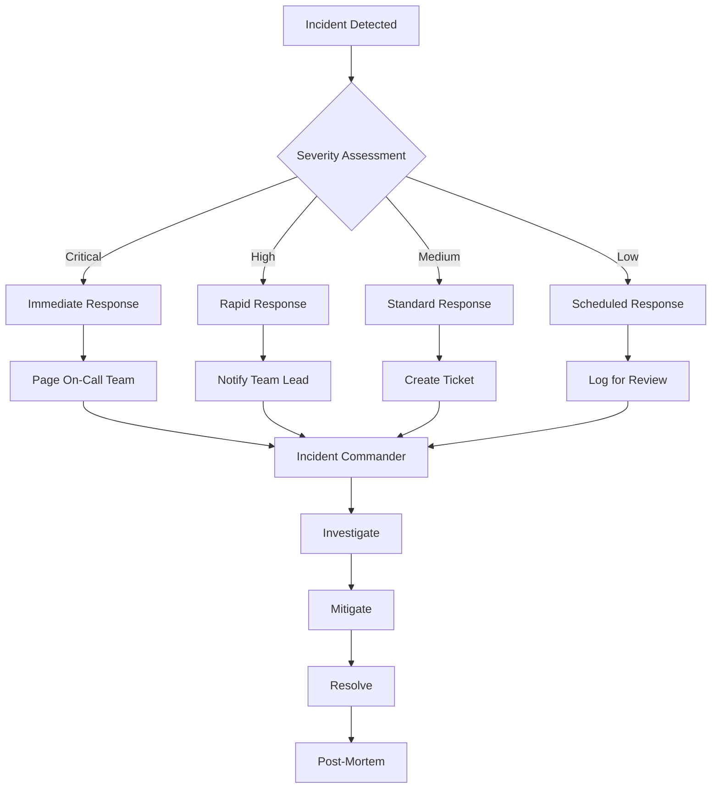
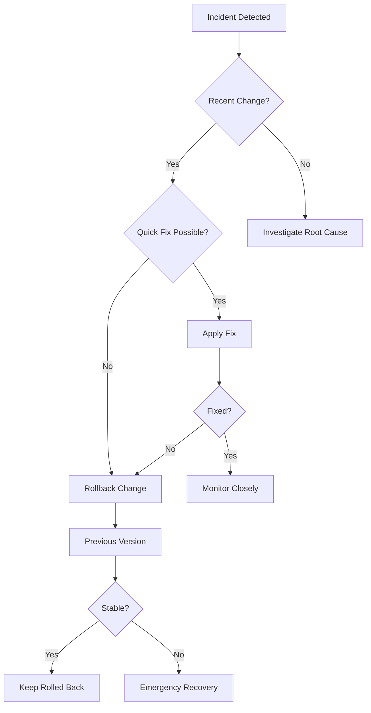

# Incident Response Runbook

Comprehensive guide for handling incidents in the League Simulator system.

## Incident Response Framework



## Severity Classification

### SEV-1: Critical (System Down)
- **Definition**: Complete system failure, data loss risk
- **Response Time**: Immediate (< 15 minutes)
- **Examples**:
  - All services down
  - Data corruption detected
  - Security breach
  - API key compromised

### SEV-2: High (Major Impact)
- **Definition**: Key functionality broken, affecting many users
- **Response Time**: < 1 hour
- **Examples**:
  - Simulation engine failing
  - Shiny app inaccessible
  - API rate limit exceeded
  - Database connection lost

### SEV-3: Medium (Partial Impact)
- **Definition**: Some functionality affected, workarounds available
- **Response Time**: < 4 hours
- **Examples**:
  - One league not updating
  - Slow performance
  - Minor data discrepancies
  - Log rotation failure

### SEV-4: Low (Minor Issue)
- **Definition**: Minimal impact, cosmetic issues
- **Response Time**: Next business day
- **Examples**:
  - UI formatting issues
  - Non-critical warnings
  - Documentation errors

## Incident Response Procedures

### 1. Initial Response (0-15 minutes)

```bash
#!/bin/bash
# incident_initial_response.sh

INCIDENT_ID="INC-$(date +%Y%m%d-%H%M%S)"
echo "=== Incident Response Started: $INCIDENT_ID ==="

# 1. Capture system state
echo "Capturing system state..."
docker-compose ps > "incidents/${INCIDENT_ID}_docker_ps.txt"
docker stats --no-stream > "incidents/${INCIDENT_ID}_docker_stats.txt"
df -h > "incidents/${INCIDENT_ID}_disk_usage.txt"
free -m > "incidents/${INCIDENT_ID}_memory.txt"

# 2. Capture recent logs
echo "Capturing logs..."
docker-compose logs --tail=1000 > "incidents/${INCIDENT_ID}_docker_logs.txt"
tail -n 1000 logs/*.log > "incidents/${INCIDENT_ID}_app_logs.txt"

# 3. Test critical components
echo "Testing components..."
curl -s -o /dev/null -w "Shiny App: %{http_code}\n" http://localhost:3838
docker-compose exec league-simulator Rscript -e "cat('R Engine: OK\n')" 2>&1

# 4. Create incident report template
cat > "incidents/${INCIDENT_ID}_report.md" << EOF
# Incident Report: $INCIDENT_ID

## Summary
- **Time Detected**: $(date)
- **Severity**: [SEV-?]
- **Status**: Investigating
- **Impact**: [Describe impact]

## Timeline
- $(date '+%H:%M'): Incident detected
- [Add updates here]

## Root Cause
[To be determined]

## Resolution
[To be determined]

## Action Items
- [ ] Immediate fixes
- [ ] Long-term improvements
EOF

echo "Initial response complete. Incident ID: $INCIDENT_ID"
```

### 2. Common Incident Playbooks

#### Playbook: Service Not Responding

```bash
#!/bin/bash
# playbook_service_down.sh

SERVICE=$1
echo "Executing playbook for service: $SERVICE"

# 1. Check if container is running
if ! docker-compose ps | grep -q "$SERVICE.*Up"; then
    echo "Container not running. Attempting restart..."
    docker-compose restart $SERVICE
    sleep 30
fi

# 2. Check logs for errors
echo "Recent errors:"
docker-compose logs --tail=50 $SERVICE | grep -i error

# 3. Check resource usage
docker stats --no-stream --format "table {{.Container}}\t{{.CPUPerc}}\t{{.MemUsage}}" | grep $SERVICE

# 4. Test service health
case $SERVICE in
    "league-simulator")
        docker-compose exec $SERVICE Rscript -e "source('test_api_connection.R')"
        ;;
    "shiny-app")
        curl -I http://localhost:3838
        ;;
esac

# 5. Escalate if needed
if ! docker-compose ps | grep -q "$SERVICE.*Up"; then
    echo "ESCALATION REQUIRED: Service still down after restart"
    # Send alert
fi
```

#### Playbook: API Rate Limit Exceeded

```r
# playbook_api_rate_limit.R

handle_rate_limit <- function() {
  cat("=== API Rate Limit Exceeded Playbook ===\n")
  
  # 1. Check current usage
  source("RCode/check_api_quota.R")
  quota_info <- check_api_quota()
  
  # 2. Calculate wait time
  reset_time <- as.POSIXct(quota_info$reset)
  wait_seconds <- as.numeric(difftime(reset_time, Sys.time(), units = "secs"))
  
  cat(sprintf("Rate limit resets in: %d minutes\n", ceiling(wait_seconds / 60)))
  
  # 3. Implement backoff strategy
  if (wait_seconds > 3600) {
    # Long wait - reschedule
    cat("Rescheduling next update for:", format(reset_time), "\n")
    
    # Update scheduler
    update_scheduler_config(next_run = reset_time + 300)
    
  } else if (wait_seconds > 300) {
    # Medium wait - pause operations
    cat("Pausing operations for", ceiling(wait_seconds / 60), "minutes\n")
    Sys.sleep(wait_seconds)
    
  } else {
    # Short wait - continue with delay
    cat("Brief pause, continuing soon\n")
    Sys.sleep(wait_seconds)
  }
  
  # 4. Resume operations
  cat("Resuming normal operations\n")
}
```

#### Playbook: Simulation Failure

```r
# playbook_simulation_failure.R

diagnose_simulation_failure <- function(league_id) {
  cat("=== Simulation Failure Diagnosis ===\n")
  
  # 1. Check team data
  teams_file <- sprintf("RCode/TeamList_%d.csv", as.numeric(format(Sys.Date(), "%Y")))
  if (!file.exists(teams_file)) {
    stop("Team file not found:", teams_file)
  }
  
  teams <- read.csv(teams_file)
  league_teams <- teams[teams$liga == league_id, ]
  cat("Teams in league:", nrow(league_teams), "\n")
  
  # 2. Test with minimal simulation
  source("RCode/simulationsCPP.R")
  test_result <- tryCatch({
    simulate_league(league_id, iterations = 10)
    "SUCCESS"
  }, error = function(e) {
    e$message
  })
  
  cat("Minimal simulation test:", test_result, "\n")
  
  # 3. Check memory
  mem_info <- system("free -m", intern = TRUE)
  cat("Memory status:\n", mem_info[2], "\n")
  
  # 4. Verify dependencies
  required_packages <- c("Rcpp", "dplyr", "httr")
  missing <- required_packages[!required_packages %in% installed.packages()[,"Package"]]
  
  if (length(missing) > 0) {
    cat("Missing packages:", paste(missing, collapse = ", "), "\n")
    install.packages(missing)
  }
  
  # 5. Attempt recovery
  if (test_result == "SUCCESS") {
    cat("Recovery successful. Resuming normal operations.\n")
    return(TRUE)
  } else {
    cat("Recovery failed. Manual intervention required.\n")
    return(FALSE)
  }
}
```

#### Playbook: Data Corruption

```bash
#!/bin/bash
# playbook_data_corruption.sh

echo "=== Data Corruption Recovery Playbook ==="

# 1. Stop all operations immediately
docker-compose stop

# 2. Identify corrupted files
echo "Checking for corrupted files..."
find ShinyApp/data -name "*.Rds" -exec Rscript -e "
  tryCatch({
    readRDS('{}')
    cat('OK: {}\n')
  }, error = function(e) {
    cat('CORRUPTED: {}\n')
  })
" \;

# 3. Restore from backup
BACKUP_DIR="/backups/$(date -d yesterday +%Y%m%d)"
if [ -d "$BACKUP_DIR" ]; then
    echo "Restoring from backup: $BACKUP_DIR"
    cp $BACKUP_DIR/*.Rds ShinyApp/data/
else
    echo "ERROR: No backup found for yesterday"
    # Try older backups
    LATEST_BACKUP=$(ls -t /backups | head -1)
    echo "Using backup: $LATEST_BACKUP"
    cp /backups/$LATEST_BACKUP/*.Rds ShinyApp/data/
fi

# 4. Verify restoration
Rscript -e "
  files <- list.files('ShinyApp/data', pattern='Rds$', full.names=TRUE)
  for (f in files) {
    tryCatch({
      data <- readRDS(f)
      cat('Verified:', basename(f), '\n')
    }, error = function(e) {
      cat('Still corrupted:', basename(f), '\n')
    })
  }
"

# 5. Restart services
docker-compose up -d

echo "Recovery complete. Monitor closely."
```

### 3. Communication Templates

#### Initial Notification

```markdown
**INCIDENT ALERT**

- **Incident ID**: INC-20250119-1530
- **Severity**: SEV-2
- **Status**: Investigating
- **Impact**: Bundesliga simulations not updating
- **Start Time**: 15:30 CET

We are investigating an issue with Bundesliga simulation updates. 
Other leagues are operating normally.

Next update in 15 minutes.
```

#### Status Update

```markdown
**INCIDENT UPDATE**

- **Incident ID**: INC-20250119-1530
- **Status**: Mitigating
- **Update**: Root cause identified - API rate limit exceeded

**Actions Taken**:
- Implemented request throttling
- Rescheduled simulations
- Normal operations to resume at 16:00

Next update in 30 minutes or when resolved.
```

#### Resolution Notice

```markdown
**INCIDENT RESOLVED**

- **Incident ID**: INC-20250119-1530
- **Resolution Time**: 16:15 CET
- **Total Duration**: 45 minutes
- **Root Cause**: API rate limit exceeded due to retry loop

**Resolution**: 
- Fixed retry logic
- Added rate limit monitoring
- All systems operational

Post-mortem scheduled for Monday 10:00 CET.
```

### 4. Escalation Matrix

| Time Elapsed | SEV-1 | SEV-2 | SEV-3 | SEV-4 |
|--------------|-------|-------|-------|-------|
| 0-15 min | IC + All Teams | IC + Team Lead | Engineer | Log Only |
| 15-30 min | + Manager | + Manager | Team Lead | Engineer |
| 30-60 min | + Director | + Senior Eng | Manager | Team Lead |
| 60+ min | + Executive | + Director | + Senior Eng | Manager |

**IC** = Incident Commander

### 5. Incident Commander Checklist

- [ ] Assess severity and impact
- [ ] Notify appropriate stakeholders
- [ ] Assign roles (investigate, communicate, document)
- [ ] Create incident channel/bridge
- [ ] Coordinate response efforts
- [ ] Make critical decisions
- [ ] Approve external communications
- [ ] Schedule post-mortem
- [ ] Ensure documentation complete

## Recovery Procedures

### Service Recovery Priority

1. **Database/Data Store** - Ensure data integrity
2. **API Connections** - Restore external data access
3. **Simulation Engine** - Resume calculations
4. **Web Interface** - Restore user access
5. **Monitoring** - Verify all metrics flowing

### Rollback Decision Tree



## Post-Incident Activities

### 1. Immediate (Within 24 hours)

```bash
#!/bin/bash
# post_incident_immediate.sh

INCIDENT_ID=$1

# Create post-mortem template
cat > "incidents/${INCIDENT_ID}_postmortem.md" << 'EOF'
# Post-Mortem: ${INCIDENT_ID}

## Incident Summary
- **Date**: 
- **Duration**: 
- **Impact**: 
- **Severity**: 

## Timeline
[Detailed timeline of events]

## Root Cause Analysis

### What Happened
[Factual description]

### Why It Happened
[5 Whys analysis]

### Contributing Factors
- [ ] Human error
- [ ] Process failure
- [ ] Technical failure
- [ ] External factors

## Impact Assessment
- **Users Affected**: 
- **Data Loss**: None/Partial/Complete
- **Financial Impact**: 
- **Reputation Impact**: 

## What Went Well
- 
- 

## What Went Poorly
- 
- 

## Action Items
| Action | Owner | Due Date | Priority |
|--------|-------|----------|----------|
| | | | |

## Lessons Learned
1. 
2. 

## Supporting Data
- Logs: [Link]
- Metrics: [Link]
- Communications: [Link]
EOF

echo "Post-mortem template created: incidents/${INCIDENT_ID}_postmortem.md"
```

### 2. Short-term (Within 1 week)

- Complete post-mortem document
- Implement quick fixes
- Update runbooks
- Share lessons learned
- Update monitoring alerts

### 3. Long-term (Within 1 month)

- Implement preventive measures
- Update architecture if needed
- Conduct incident response training
- Review and update SLAs
- Perform disaster recovery drill

## Incident Response Tools

### Monitoring Commands

```bash
# Quick system check
alias incident-check='docker-compose ps && docker stats --no-stream && df -h'

# Capture all logs
alias incident-logs='docker-compose logs > incident_$(date +%Y%m%d_%H%M%S).log'

# Emergency restart
alias incident-restart='docker-compose down && docker-compose up -d'
```

### Diagnostic Scripts

```r
# incident_diagnostics.R
run_full_diagnostics <- function() {
  diagnostics <- list()
  
  # System checks
  diagnostics$system <- list(
    memory = system("free -m", intern = TRUE),
    disk = system("df -h", intern = TRUE),
    processes = system("ps aux | grep R", intern = TRUE)
  )
  
  # Application checks
  diagnostics$app <- list(
    api_connection = tryCatch(test_api_connection(), error = function(e) e$message),
    team_data = file.exists("RCode/TeamList_2025.csv"),
    output_dir = dir.exists("ShinyApp/data"),
    recent_files = list.files("ShinyApp/data", pattern = "*.Rds", full.names = TRUE)
  )
  
  # Save diagnostics
  saveRDS(diagnostics, sprintf("incidents/diagnostics_%s.rds", 
                               format(Sys.time(), "%Y%m%d_%H%M%S")))
  
  return(diagnostics)
}
```

## Related Documentation

- [Daily Operations](daily-operations.md)
- [Monitoring Guide](monitoring.md)
- [Backup Recovery](backup-recovery.md)
- [Troubleshooting](../troubleshooting/common-issues.md)