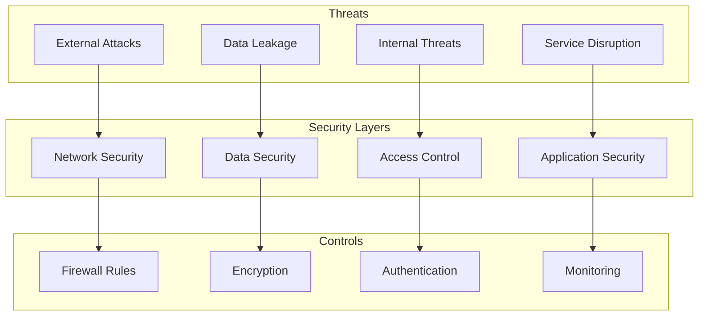

# Security Procedures

Comprehensive security guidelines and procedures for the League Simulator system.

## Security Overview



## Security Principles

1. **Defense in Depth**: Multiple layers of security
2. **Least Privilege**: Minimal necessary access
3. **Zero Trust**: Verify everything
4. **Secure by Default**: Security built-in, not added
5. **Continuous Monitoring**: Real-time threat detection

## Access Control

### API Key Management

```bash
#!/bin/bash
# secure_api_keys.sh

# 1. Generate secure API key storage
echo "Setting up secure API key storage..."

# Create encrypted key file
read -sp "Enter API key: " API_KEY
echo

# Encrypt with GPG
echo "$API_KEY" | gpg --encrypt --armor --recipient admin@league-simulator.com > api_key.gpg

# Store in environment securely
cat > .env.encrypted << EOF
RAPIDAPI_KEY=\$(gpg --decrypt api_key.gpg 2>/dev/null)
EOF

# Set restrictive permissions
chmod 600 .env.encrypted
chmod 600 api_key.gpg

# Clean up
unset API_KEY

echo "API key secured"
```

### User Access Management

```yaml
# access_control.yaml
roles:
  admin:
    description: "Full system access"
    permissions:
      - read:*
      - write:*
      - delete:*
      - admin:*
    
  operator:
    description: "Day-to-day operations"
    permissions:
      - read:*
      - write:data
      - execute:simulations
      - restart:services
    
  developer:
    description: "Development access"
    permissions:
      - read:*
      - write:code
      - execute:tests
      - view:logs
    
  viewer:
    description: "Read-only access"
    permissions:
      - read:results
      - view:dashboard

users:
  - username: admin1
    role: admin
    mfa: required
    
  - username: ops1
    role: operator
    mfa: required
    
  - username: dev1
    role: developer
    mfa: optional
```

### SSH Key Management

```bash
#!/bin/bash
# setup_ssh_access.sh

# Generate deployment key
ssh-keygen -t ed25519 -f ~/.ssh/league_simulator_deploy -C "deploy@league-simulator"

# Add to authorized keys with restrictions
echo 'command="/usr/local/bin/deploy_only.sh",no-port-forwarding,no-X11-forwarding,no-agent-forwarding' \
  $(cat ~/.ssh/league_simulator_deploy.pub) >> ~/.ssh/authorized_keys

# Create restricted deploy script
cat > /usr/local/bin/deploy_only.sh << 'EOF'
#!/bin/bash
case "$SSH_ORIGINAL_COMMAND" in
  "docker-compose up -d")
    exec docker-compose up -d
    ;;
  "docker-compose restart")
    exec docker-compose restart
    ;;
  *)
    echo "Unauthorized command"
    exit 1
    ;;
esac
EOF

chmod +x /usr/local/bin/deploy_only.sh
```

## Network Security

### Firewall Configuration

```bash
#!/bin/bash
# configure_firewall.sh

# Default policies
iptables -P INPUT DROP
iptables -P FORWARD DROP
iptables -P OUTPUT ACCEPT

# Allow established connections
iptables -A INPUT -m state --state ESTABLISHED,RELATED -j ACCEPT

# Allow loopback
iptables -A INPUT -i lo -j ACCEPT

# Allow SSH (restricted)
iptables -A INPUT -p tcp --dport 22 -s 10.0.0.0/8 -j ACCEPT

# Allow HTTP/HTTPS for Shiny
iptables -A INPUT -p tcp --dport 80 -j ACCEPT
iptables -A INPUT -p tcp --dport 443 -j ACCEPT

# Allow internal Docker communication
iptables -A INPUT -i docker0 -j ACCEPT

# Rate limiting
iptables -A INPUT -p tcp --dport 80 -m limit --limit 100/minute --limit-burst 200 -j ACCEPT
iptables -A INPUT -p tcp --dport 80 -j DROP

# Log dropped packets
iptables -A INPUT -j LOG --log-prefix "IPT-DROP: "

# Save rules
iptables-save > /etc/iptables/rules.v4
```

### SSL/TLS Configuration

```nginx
# nginx_ssl.conf
server {
    listen 443 ssl http2;
    server_name league-simulator.com;
    
    # SSL Configuration
    ssl_certificate /etc/ssl/certs/league-simulator.crt;
    ssl_certificate_key /etc/ssl/private/league-simulator.key;
    
    # Modern SSL configuration
    ssl_protocols TLSv1.2 TLSv1.3;
    ssl_ciphers ECDHE-ECDSA-AES128-GCM-SHA256:ECDHE-RSA-AES128-GCM-SHA256:ECDHE-ECDSA-AES256-GCM-SHA384:ECDHE-RSA-AES256-GCM-SHA384;
    ssl_prefer_server_ciphers off;
    
    # SSL optimization
    ssl_session_timeout 1d;
    ssl_session_cache shared:SSL:10m;
    ssl_session_tickets off;
    
    # OCSP stapling
    ssl_stapling on;
    ssl_stapling_verify on;
    
    # Security headers
    add_header Strict-Transport-Security "max-age=63072000" always;
    add_header X-Frame-Options "DENY" always;
    add_header X-Content-Type-Options "nosniff" always;
    add_header X-XSS-Protection "1; mode=block" always;
    add_header Content-Security-Policy "default-src 'self'" always;
    
    location / {
        proxy_pass http://shiny-app:3838;
        proxy_http_version 1.1;
        proxy_set_header Upgrade $http_upgrade;
        proxy_set_header Connection "upgrade";
        proxy_set_header Host $host;
        proxy_set_header X-Real-IP $remote_addr;
        proxy_set_header X-Forwarded-For $proxy_add_x_forwarded_for;
        proxy_set_header X-Forwarded-Proto $scheme;
    }
}

# Redirect HTTP to HTTPS
server {
    listen 80;
    server_name league-simulator.com;
    return 301 https://$server_name$request_uri;
}
```

## Application Security

### Secure Coding Practices

```r
# secure_api_handler.R

#' Secure API request handler
#' @param endpoint API endpoint
#' @param params Query parameters
#' @return API response or error
secure_api_request <- function(endpoint, params = list()) {
  # Input validation
  if (!is.character(endpoint) || length(endpoint) != 1) {
    stop("Invalid endpoint")
  }
  
  # Sanitize parameters
  params <- lapply(params, function(x) {
    if (is.character(x)) {
      # Remove potentially dangerous characters
      gsub("[^a-zA-Z0-9._-]", "", x)
    } else {
      x
    }
  })
  
  # Get API key securely
  api_key <- Sys.getenv("RAPIDAPI_KEY")
  if (nchar(api_key) == 0) {
    stop("API key not configured")
  }
  
  # Rate limiting
  if (!check_rate_limit()) {
    stop("Rate limit exceeded")
  }
  
  # Make request with timeout
  response <- tryCatch({
    httr::GET(
      url = endpoint,
      query = params,
      httr::add_headers("X-RapidAPI-Key" = api_key),
      httr::timeout(30)
    )
  }, error = function(e) {
    log_security_event("api_request_failed", list(
      endpoint = endpoint,
      error = e$message
    ))
    stop("API request failed")
  })
  
  # Validate response
  if (httr::status_code(response) != 200) {
    log_security_event("api_error_response", list(
      endpoint = endpoint,
      status = httr::status_code(response)
    ))
    stop("API returned error")
  }
  
  return(response)
}

#' Check rate limiting
check_rate_limit <- function() {
  # Implement token bucket algorithm
  # Returns TRUE if request allowed, FALSE otherwise
  TRUE  # Placeholder
}

#' Log security events
log_security_event <- function(event_type, details) {
  event <- list(
    timestamp = Sys.time(),
    type = event_type,
    details = details,
    user = Sys.getenv("USER"),
    pid = Sys.getpid()
  )
  
  # Write to security log
  cat(jsonlite::toJSON(event, auto_unbox = TRUE), "\n",
      file = "logs/security.log", append = TRUE)
}
```

### Input Validation

```r
# input_validation_security.R

#' Validate league ID
validate_league_id <- function(league_id) {
  if (!is.numeric(league_id) || length(league_id) != 1) {
    stop("Invalid league_id: must be single numeric value")
  }
  
  if (!league_id %in% c(78, 79, 80)) {
    stop("Invalid league_id: must be 78, 79, or 80")
  }
  
  return(as.integer(league_id))
}

#' Validate season
validate_season <- function(season) {
  if (!is.numeric(season) || length(season) != 1) {
    stop("Invalid season: must be single numeric value")
  }
  
  current_year <- as.integer(format(Sys.Date(), "%Y"))
  if (season < 2020 || season > current_year + 1) {
    stop("Invalid season: out of valid range")
  }
  
  return(as.integer(season))
}

#' Sanitize file paths
sanitize_file_path <- function(path) {
  # Remove directory traversal attempts
  path <- gsub("\\.\\./", "", path)
  path <- gsub("^/", "", path)
  
  # Allow only specific file extensions
  if (!grepl("\\.(csv|rds|log)$", path, ignore.case = TRUE)) {
    stop("Invalid file type")
  }
  
  # Ensure path is within allowed directories
  allowed_dirs <- c("RCode", "ShinyApp/data", "logs")
  if (!any(sapply(allowed_dirs, function(dir) startsWith(path, dir)))) {
    stop("Access denied: path outside allowed directories")
  }
  
  return(path)
}
```

### Container Security

```dockerfile
# Dockerfile.secure
FROM rocker/r-ver:4.2.3 AS builder

# Don't run as root
RUN useradd -m -u 1000 -s /bin/bash appuser

# Install only necessary packages
RUN apt-get update && apt-get install -y --no-install-recommends \
    libcurl4-openssl-dev \
    libssl-dev \
    && rm -rf /var/lib/apt/lists/*

# Copy and build as user
USER appuser
WORKDIR /home/appuser

COPY --chown=appuser:appuser renv.lock .
RUN R -e "install.packages('renv')" && \
    R -e "renv::restore()"

# Production stage
FROM rocker/r-ver:4.2.3-slim

# Security updates
RUN apt-get update && apt-get upgrade -y && \
    rm -rf /var/lib/apt/lists/*

# Create non-root user
RUN useradd -m -u 1000 -s /bin/bash appuser

# Copy application
COPY --from=builder --chown=appuser:appuser /home/appuser/renv /home/appuser/renv
COPY --chown=appuser:appuser . /app

# Security hardening
RUN chmod -R 750 /app && \
    find /app -name "*.sh" -exec chmod 750 {} \;

# Run as non-root
USER appuser
WORKDIR /app

# Health check
HEALTHCHECK --interval=30s --timeout=3s --start-period=5s --retries=3 \
  CMD Rscript -e "q(status = 0)" || exit 1

# No shell by default
ENTRYPOINT ["Rscript"]
CMD ["RCode/updateScheduler.R"]
```

## Data Security

### Encryption at Rest

```bash
#!/bin/bash
# encrypt_sensitive_data.sh

# Encrypt team data
gpg --symmetric --cipher-algo AES256 RCode/TeamList_2025.csv

# Encrypt configuration
tar -czf - .env* | gpg --symmetric --cipher-algo AES256 > config.tar.gz.gpg

# Secure deletion of original files
shred -vfz -n 3 .env*

# Create decryption script
cat > decrypt_data.sh << 'EOF'
#!/bin/bash
# Decrypt team data
gpg --decrypt RCode/TeamList_2025.csv.gpg > RCode/TeamList_2025.csv

# Decrypt configuration
gpg --decrypt config.tar.gz.gpg | tar -xzf -
EOF

chmod 700 decrypt_data.sh
```

### Data Masking

```r
# data_masking.R

#' Mask sensitive data for non-production use
mask_sensitive_data <- function(data) {
  if (Sys.getenv("ENVIRONMENT") != "production") {
    # Mask API keys
    if ("api_key" %in% names(data)) {
      data$api_key <- paste0(substr(data$api_key, 1, 4), 
                            "****", 
                            substr(data$api_key, nchar(data$api_key) - 3, nchar(data$api_key)))
    }
    
    # Mask team IDs in development
    if ("team_id" %in% names(data)) {
      data$team_id <- as.integer(factor(data$team_id))
    }
  }
  
  return(data)
}

#' Remove sensitive data from logs
sanitize_logs <- function(log_text) {
  # Remove API keys
  log_text <- gsub("X-RapidAPI-Key: [a-zA-Z0-9]+", "X-RapidAPI-Key: [REDACTED]", log_text)
  
  # Remove passwords
  log_text <- gsub("password['\"]?\\s*[:=]\\s*['\"]?[^'\"\\s]+", "password: [REDACTED]", log_text)
  
  # Remove email addresses
  log_text <- gsub("[a-zA-Z0-9._%+-]+@[a-zA-Z0-9.-]+\\.[a-zA-Z]{2,}", "[EMAIL_REDACTED]", log_text)
  
  return(log_text)
}
```

## Security Monitoring

### Log Analysis

```bash
#!/bin/bash
# security_monitoring.sh

# Monitor for suspicious activities
echo "=== Security Monitoring Report ==="
echo "Date: $(date)"

# Check for authentication failures
echo -e "\n## Authentication Failures"
grep -i "auth.*fail" logs/*.log | tail -20

# Check for SQL injection attempts
echo -e "\n## Potential SQL Injection"
grep -E "(union.*select|drop.*table|';|--)" logs/*.log

# Check for path traversal attempts
echo -e "\n## Path Traversal Attempts"
grep -E "\\.\\./|\\.\\.\\\\" logs/*.log

# Check for unusual API activity
echo -e "\n## API Anomalies"
awk '/API call/ {count[$5]++} END {for (ip in count) if (count[ip] > 100) print ip, count[ip]}' logs/api*.log

# Check for large data transfers
echo -e "\n## Large Data Transfers"
grep -E "bytes=(1[0-9]{8,}|[2-9][0-9]{7,})" logs/*.log

# Port scanning detection
echo -e "\n## Potential Port Scans"
netstat -an | grep SYN_RECV | awk '{print $5}' | cut -d: -f1 | sort | uniq -c | sort -nr | head -10
```

### Intrusion Detection

```r
# intrusion_detection.R

library(anomalize)
library(tibbletime)

detect_anomalies <- function(log_file) {
  # Read log data
  logs <- read.csv(log_file, stringsAsFactors = FALSE)
  
  # Convert to time series
  logs_ts <- logs %>%
    mutate(timestamp = as.POSIXct(timestamp)) %>%
    as_tbl_time(index = timestamp)
  
  # Detect anomalies in request patterns
  anomalies <- logs_ts %>%
    time_decompose(requests_per_minute) %>%
    anomalize(remainder) %>%
    time_recompose()
  
  # Alert on anomalies
  if (any(anomalies$anomaly == "Yes")) {
    alert_security_team("Anomalous activity detected", anomalies)
  }
  
  return(anomalies)
}

alert_security_team <- function(message, details) {
  # Send alerts via multiple channels
  
  # Email
  send_email(
    to = "security@league-simulator.com",
    subject = paste("[SECURITY ALERT]", message),
    body = capture.output(print(details))
  )
  
  # Slack
  post_to_slack(
    channel = "#security-alerts",
    message = message,
    details = details
  )
  
  # Log to SIEM
  log_to_siem(list(
    alert = message,
    details = details,
    timestamp = Sys.time(),
    severity = "HIGH"
  ))
}
```

## Incident Response

### Security Incident Checklist

1. **Immediate Actions** (0-5 minutes)
   - [ ] Isolate affected systems
   - [ ] Preserve evidence
   - [ ] Activate incident response team
   - [ ] Begin documentation

2. **Assessment** (5-30 minutes)
   - [ ] Determine scope of breach
   - [ ] Identify attack vector
   - [ ] Assess data exposure
   - [ ] Check for persistence

3. **Containment** (30-60 minutes)
   - [ ] Block attacker access
   - [ ] Reset compromised credentials
   - [ ] Patch vulnerabilities
   - [ ] Enhance monitoring

4. **Recovery** (1-4 hours)
   - [ ] Restore from clean backups
   - [ ] Rebuild compromised systems
   - [ ] Verify system integrity
   - [ ] Resume operations

5. **Post-Incident** (Within 48 hours)
   - [ ] Complete forensic analysis
   - [ ] Update security measures
   - [ ] Notify stakeholders if required
   - [ ] Conduct lessons learned

### Security Breach Response

```bash
#!/bin/bash
# security_breach_response.sh

INCIDENT_ID="SEC-$(date +%Y%m%d-%H%M%S)"

echo "=== SECURITY BREACH RESPONSE ==="
echo "Incident ID: $INCIDENT_ID"

# 1. Isolate system
echo "Isolating system..."
iptables -I INPUT 1 -j DROP
iptables -I OUTPUT 1 -m state --state NEW -j DROP

# 2. Capture evidence
echo "Capturing evidence..."
mkdir -p "/evidence/$INCIDENT_ID"

# Memory dump
sudo dd if=/dev/mem of="/evidence/$INCIDENT_ID/memory.dump" bs=1M

# Network connections
netstat -anp > "/evidence/$INCIDENT_ID/network_connections.txt"
ss -tulpn > "/evidence/$INCIDENT_ID/socket_stats.txt"

# Process list
ps auxf > "/evidence/$INCIDENT_ID/processes.txt"
lsof > "/evidence/$INCIDENT_ID/open_files.txt"

# System logs
tar -czf "/evidence/$INCIDENT_ID/logs.tar.gz" /var/log /app/logs

# 3. Check for persistence
echo "Checking for persistence mechanisms..."
crontab -l > "/evidence/$INCIDENT_ID/crontab.txt"
systemctl list-units --type=service > "/evidence/$INCIDENT_ID/services.txt"
find / -type f -perm -4000 2>/dev/null > "/evidence/$INCIDENT_ID/suid_files.txt"

# 4. Generate initial report
cat > "/evidence/$INCIDENT_ID/initial_report.txt" << EOF
Security Incident: $INCIDENT_ID
Time: $(date)
System: $(hostname)
Detected by: $USER

Initial Assessment:
- System isolated from network
- Evidence captured
- Investigation in progress

Next Steps:
1. Analyze captured evidence
2. Identify attack vector
3. Assess data breach scope
4. Plan remediation
EOF

echo "Initial response complete. Evidence in: /evidence/$INCIDENT_ID"
```

## Security Hardening Checklist

### System Level
- [ ] Disable unnecessary services
- [ ] Configure firewall rules
- [ ] Enable SELinux/AppArmor
- [ ] Regular security updates
- [ ] Secure boot configuration
- [ ] Audit logging enabled

### Application Level
- [ ] Input validation on all endpoints
- [ ] Output encoding
- [ ] Parameterized queries
- [ ] Secure session management
- [ ] Error handling without info leakage
- [ ] Regular dependency updates

### Network Level
- [ ] SSL/TLS everywhere
- [ ] Network segmentation
- [ ] Intrusion detection/prevention
- [ ] DDoS protection
- [ ] VPN for management access
- [ ] Regular penetration testing

### Data Level
- [ ] Encryption at rest
- [ ] Encryption in transit
- [ ] Access controls
- [ ] Data classification
- [ ] Retention policies
- [ ] Secure deletion

## Compliance and Auditing

### Security Audit Script

```bash
#!/bin/bash
# security_audit.sh

echo "=== League Simulator Security Audit ==="
echo "Date: $(date)"
echo "Auditor: $USER"

# Check file permissions
echo -e "\n## File Permissions"
find /app -type f -perm -o+w -ls 2>/dev/null | head -20

# Check for default passwords
echo -e "\n## Default Passwords"
grep -r "password.*=" /app --include="*.R" --include="*.sh" | grep -v "getenv"

# SSL certificate check
echo -e "\n## SSL Certificate"
openssl s_client -connect localhost:443 </dev/null 2>/dev/null | openssl x509 -noout -dates

# Check for outdated packages
echo -e "\n## Outdated Packages"
Rscript -e "old.packages()"

# Security headers test
echo -e "\n## Security Headers"
curl -I https://localhost | grep -E "(Strict-Transport|X-Frame|X-Content|X-XSS)"

# Generate compliance report
cat > "audit_report_$(date +%Y%m%d).md" << EOF
# Security Audit Report

Date: $(date)

## Findings
[Add findings here]

## Recommendations
[Add recommendations here]

## Compliance Status
- [ ] GDPR compliant
- [ ] Security best practices
- [ ] Regular updates
- [ ] Incident response plan
- [ ] Data protection measures
EOF
```

## Related Documentation

- [Incident Response](incident-response.md)
- [Access Control](../deployment/production.md#security)
- [Data Protection](backup-recovery.md)
- [Network Security](../architecture/overview.md#security)