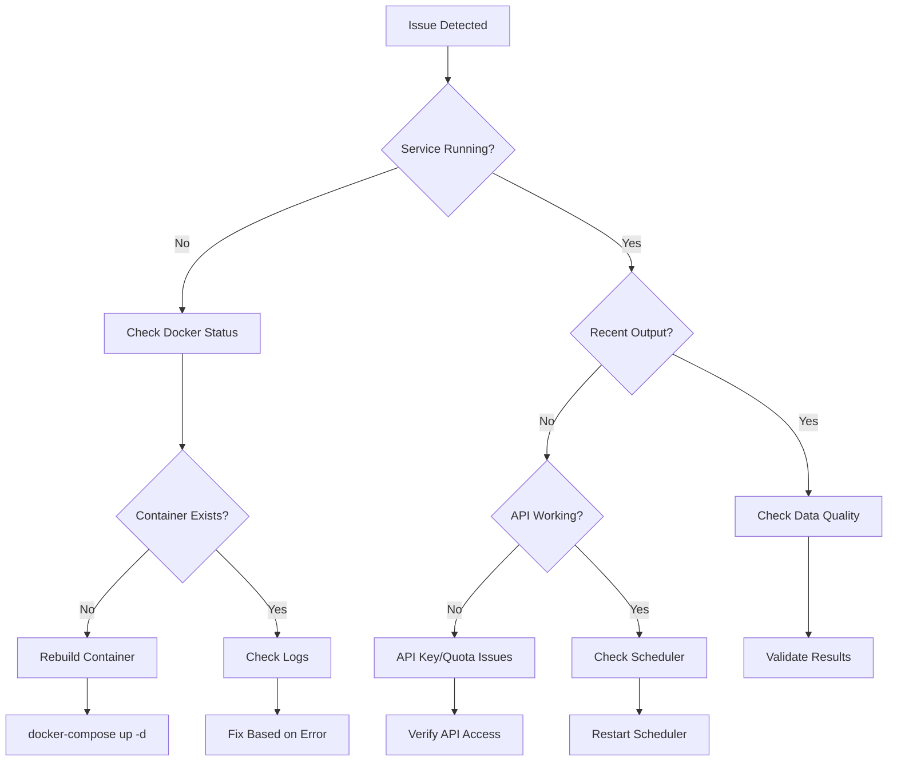

# Common Issues and Solutions

Quick reference guide for troubleshooting common League Simulator problems.

## Quick Diagnosis Flowchart



## Top 10 Common Issues

### 1. Service Won't Start

**Symptoms:**
- Container exits immediately
- `docker-compose ps` shows "Exit 1"

**Diagnosis:**
```bash
# Check logs
docker-compose logs league-simulator | tail -50

# Common error patterns
docker-compose logs | grep -E "(ERROR|FATAL|Failed)"
```

**Solutions:**

```bash
# Solution 1: Missing environment variables
cat .env  # Verify all required vars present
# Required: RAPIDAPI_KEY, SEASON

# Solution 2: File permissions
ls -la RCode/  # Check readable
chmod -R 755 RCode/
chown -R $(id -u):$(id -g) .

# Solution 3: Corrupted image
docker-compose down
docker-compose build --no-cache
docker-compose up -d
```

### 2. API Rate Limit Exceeded

**Symptoms:**
- Error: "429 Too Many Requests"
- Simulations stop updating

**Diagnosis:**
```r
# Check API quota
Rscript -e "
  source('RCode/check_api_quota.R')
  check_api_quota()
"
```

**Solutions:**

```r
# Solution 1: Wait for reset
get_rate_limit_reset <- function() {
  response <- httr::GET(
    "https://v3.football.api-sports.io/status",
    httr::add_headers("X-RapidAPI-Key" = Sys.getenv("RAPIDAPI_KEY"))
  )
  
  reset_time <- as.POSIXct(content(response)$response$requests$reset)
  wait_time <- difftime(reset_time, Sys.time(), units = "mins")
  
  cat("Rate limit resets in:", round(wait_time, 1), "minutes\n")
  cat("Reset time:", format(reset_time, "%H:%M:%S"), "\n")
}

# Solution 2: Reduce request frequency
# Edit RCode/updateScheduler.R
# Reduce update_times array

# Solution 3: Implement caching
source("RCode/api_cache.R")
enable_api_caching(duration_minutes = 60)
```

### 3. No Simulation Results

**Symptoms:**
- ShinyApp/data/ empty or outdated
- No recent .Rds files

**Diagnosis:**
```bash
# Check last simulation time
ls -la ShinyApp/data/*.Rds | tail -5

# Check if scheduler running
docker-compose exec league-simulator ps aux | grep R

# Check for errors in simulation
grep "simulate" logs/*.log | grep -i error
```

**Solutions:**

```r
# Solution 1: Manual trigger
docker-compose exec league-simulator Rscript run_single_update_2025.R

# Solution 2: Fix team data
# Verify team file exists and is valid
teams <- read.csv("RCode/TeamList_2025.csv")
print(summary(teams))
# Should show id, name, elo, liga, season columns

# Solution 3: Reset scheduler
docker-compose restart league-simulator
```

### 4. Shiny App Not Loading

**Symptoms:**
- Blank page or "Loading..." forever
- Connection refused on port 3838

**Diagnosis:**
```bash
# Check if Shiny running
docker-compose ps shiny-app
curl -I http://localhost:3838

# Check Shiny logs
docker-compose logs shiny-app | grep -E "(ERROR|Warning)"
```

**Solutions:**

```bash
# Solution 1: Restart Shiny
docker-compose restart shiny-app

# Solution 2: Check data files
docker-compose exec shiny-app ls -la /app/ShinyApp/data/

# Solution 3: Debug Shiny app
docker-compose exec shiny-app R
# In R:
# shiny::runApp("ShinyApp/app.R", port = 3838, host = "0.0.0.0")
```

### 5. ELO Ratings Not Updating

**Symptoms:**
- Same ELO values after matches
- Team rankings don't change

**Diagnosis:**
```r
# Check ELO calculation
source("RCode/SpielNichtSimulieren.cpp")
teams_before <- read.csv("RCode/TeamList_2025.csv")

# Simulate one match
result <- list(
  home_team_id = 157,
  away_team_id = 165,
  home_goals = 2,
  away_goals = 1
)

teams_after <- updateEloRatings(teams_before, result)
# Compare ELO values
```

**Solutions:**

```r
# Solution 1: Recompile Rcpp code
Rcpp::sourceCpp("RCode/SpielNichtSimulieren.cpp")

# Solution 2: Verify match data
matches <- retrieve_match_data(78, 2025)
print(head(matches))  # Should have recent matches

# Solution 3: Reset team data
# Backup current
write.csv(teams, "RCode/TeamList_2025_backup.csv", row.names = FALSE)
# Restore from known good
file.copy("backups/TeamList_2025_good.csv", "RCode/TeamList_2025.csv", overwrite = TRUE)
```

### 6. Docker Memory Issues

**Symptoms:**
- "Cannot allocate memory"
- Container killed (exit code 137)

**Diagnosis:**
```bash
# Check memory usage
docker stats --no-stream
free -h

# Check container limits
docker inspect league-simulator | grep -A 5 Memory
```

**Solutions:**

```bash
# Solution 1: Increase memory limits
# Edit docker-compose.yml:
# services:
#   league-simulator:
#     deploy:
#       resources:
#         limits:
#           memory: 4G

# Solution 2: Reduce simulation iterations
# Edit run_single_update_2025.R
# Change iterations from 10000 to 5000

# Solution 3: Clean up Docker
docker system prune -a
docker volume prune
```

### 7. Season Transition Failures

**Symptoms:**
- Script hangs waiting for input
- New season TeamList not created

**Diagnosis:**
```bash
# Check if running interactively
docker-compose exec -T league-simulator echo "Non-interactive"

# Check for existing team file
ls -la RCode/TeamList_2026.csv
```

**Solutions:**

```bash
# Solution 1: Use non-interactive mode
docker-compose exec league-simulator \
  Rscript scripts/season_transition.R 2025 2026 --non-interactive

# Solution 2: Use config file
cat > season_config.json << EOF
{
  "new_teams": {
    "999": {
      "name": "New Team FC",
      "league": 2,
      "elo": 1500
    }
  }
}
EOF

docker-compose exec league-simulator \
  Rscript scripts/season_transition.R 2025 2026 --config season_config.json

# Solution 3: Run interactively
docker-compose exec -it league-simulator \
  Rscript scripts/season_transition.R 2025 2026
```

### 8. Time Zone Issues

**Symptoms:**
- Simulations run at wrong times
- Scheduler off by hours

**Diagnosis:**
```bash
# Check container timezone
docker-compose exec league-simulator date

# Check system timezone
timedatectl

# Check R timezone
docker-compose exec league-simulator Rscript -e "Sys.timezone()"
```

**Solutions:**

```bash
# Solution 1: Set timezone in docker-compose.yml
# environment:
#   - TZ=Europe/Berlin

# Solution 2: Set in Dockerfile
# ENV TZ=Europe/Berlin
# RUN ln -snf /usr/share/zoneinfo/$TZ /etc/localtime

# Solution 3: Set in R code
# Sys.setenv(TZ = "Europe/Berlin")
```

### 9. Corrupt Data Files

**Symptoms:**
- "Error reading RDS file"
- Unexpected data structures

**Diagnosis:**
```r
# Test file integrity
test_rds_files <- function() {
  files <- list.files("ShinyApp/data", pattern = "\\.Rds$", full.names = TRUE)
  
  for (file in files) {
    cat("Testing:", basename(file), "... ")
    result <- tryCatch({
      data <- readRDS(file)
      cat("OK (", format(object.size(data), units = "MB"), ")\n")
      TRUE
    }, error = function(e) {
      cat("CORRUPT:", e$message, "\n")
      FALSE
    })
  }
}

test_rds_files()
```

**Solutions:**

```bash
# Solution 1: Remove corrupt files
rm ShinyApp/data/Ergebnis_corrupted.Rds

# Solution 2: Restore from backup
cp /backups/latest/*.Rds ShinyApp/data/

# Solution 3: Regenerate
docker-compose exec league-simulator \
  Rscript run_single_update_2025.R
```

### 10. Performance Degradation

**Symptoms:**
- Simulations taking longer than usual
- High CPU/memory usage

**Diagnosis:**
```bash
# Monitor performance
docker stats

# Check simulation times
grep "Simulation completed" logs/*.log | tail -10

# Profile R code
docker-compose exec league-simulator R
# profvis::profvis({
#   source("RCode/simulationsCPP.R")
#   simulate_league(78, iterations = 1000)
# })
```

**Solutions:**

```r
# Solution 1: Optimize code
# Use vectorization instead of loops
# Preallocate memory for large objects

# Solution 2: Reduce complexity
# Decrease iterations temporarily
Sys.setenv(SIMULATION_ITERATIONS = 5000)

# Solution 3: Scale resources
# Add more CPU cores for parallel processing
# Edit docker-compose.yml:
# cpus: '4'
```

## Quick Fix Commands

```bash
# Restart everything
docker-compose down && docker-compose up -d

# Force rebuild
docker-compose build --no-cache && docker-compose up -d

# Check all logs
docker-compose logs --tail=100

# Run health check
docker-compose exec league-simulator Rscript -e "source('health_check.R')"

# Clear cache
find cache/ -name "*.rds" -delete

# Reset to clean state
git clean -fdx && git reset --hard
```

## Diagnostic Script

Save this as `diagnose.sh`:

```bash
#!/bin/bash
# diagnose.sh - Comprehensive diagnostic script

echo "=== League Simulator Diagnostics ==="
echo "Date: $(date)"
echo "===================================="

# 1. Service Status
echo -e "\n## Service Status"
docker-compose ps

# 2. Recent Errors
echo -e "\n## Recent Errors (last 50 lines)"
docker-compose logs --tail=50 | grep -i error || echo "No errors found"

# 3. API Status
echo -e "\n## API Connection"
docker-compose exec league-simulator Rscript test_api_connection.R 2>&1

# 4. Data Files
echo -e "\n## Recent Data Files"
ls -lah ShinyApp/data/*.Rds 2>/dev/null | tail -5 || echo "No data files found"

# 5. Memory Usage
echo -e "\n## Memory Usage"
docker stats --no-stream

# 6. Disk Space
echo -e "\n## Disk Space"
df -h | grep -E "^/|Filesystem"

# 7. Environment
echo -e "\n## Environment Variables"
docker-compose exec league-simulator env | grep -E "(API|SEASON|TZ)" | sed 's/=.*KEY.*/=***HIDDEN***/'

echo -e "\n=== Diagnostics Complete ==="
```

## When All Else Fails

1. **Complete Reset**:
   ```bash
   docker-compose down -v
   docker system prune -a
   git pull origin main
   docker-compose build
   docker-compose up -d
   ```

2. **Contact Support**:
   - Include output from `diagnose.sh`
   - Attach recent log files
   - Describe steps to reproduce

3. **Emergency Contacts**:
   - API Support: `support@api-football.com`
   - Docker Issues: Check Docker Desktop logs
   - Application Issues: Create GitHub issue

## Related Documentation

- [Log Analysis](log-analysis.md)
- [Performance Tuning](performance.md)
- [Debugging Guide](debugging.md)
- [Incident Response](../operations/incident-response.md)